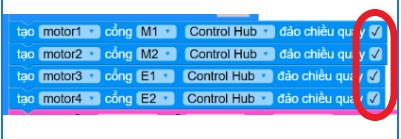

2. 2. Robot chạy ngược chiều, ngược hướng, 4 bánh chạy không cùng chiều
==================
Khi nạp chương trình tham khảo, robot hoạt động nhưng động cơ quay không đúng chiều, làm cho robot di chuyển không như mong muốn.

Nguyên nhân:
    - Do thiết lập tạo robot chưa khớp với thực tế robot đang sử dụng.
    - Do 1 động cơ quay ngược chiều với 3 động cơ còn lại.

Cách xử lý:
    - Kiểm tra các lệnh tạo động cơ, các vị trí cắm động cơ có tương ứng với cấu hình robot không? 

    Nếu đúng thì kiểm tra chiều quay động cơ, khi bị ngược thì có thể tick/ bỏ tick vào ô đảo chiểu quay.
    - Khi động cơ bị ngược chiều, cần xác định đúng động cơ, tìm đúng câu lệnh tạo động cơ để tick/ bỏ tick phần đảo chiều quay.
    **Lưu ý chỉ thao tác đúng với động cơ bị ngược**

    
