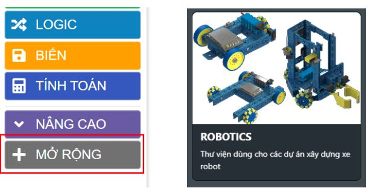

2. 1. Lỗi mở link chương trình mẫu ra nhưng không thấy các khối lệnh
==================
Khi mở link chương trình mẫu, trang lập trình đã hiện ra nhưng chương trình không hiển thị trên màn hình. 

Nguyên nhân:
    - Do lần đầu mở trang lập trình, chưa có các khối lệnh của robot
    - Đường liên kết chia sẻ bị sai (nên tô đen đường link rồi dán vào trình duyệt)

Cách xử lý:
    - Thao tác tải thư viện **Robotics** từ mục **MỞ RỘNG** trong giao diện lập trình.
    - Sau khi đã tải thư viện thành công, tiến hành tải lại trang lập trình, chương trình sẽ hiện ra trên giao diện lập trình.
    