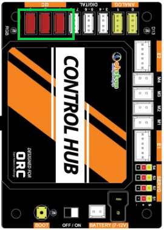
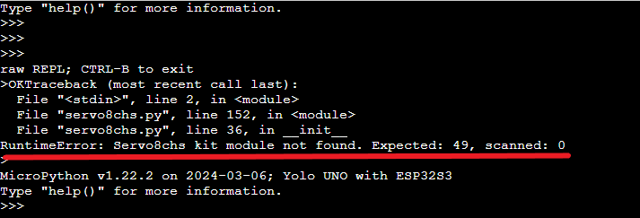

2. 10. Lỗi khi dùng ORC với module 8 kênh servo
==================

Module 8 kênh servo là 1 module giúp mở rộng cơ cấu dùng nhiều servo cho robot ORC gồm có 8 cổng servo mở rộng. Khi kết nối và lập trình cho robot ORC, robot không hoạt động, chúng ta sẽ tham khảo các cách xử lý sau:

**Lỗi cắm sai cổng kết nối**
-------
- Khi dùng module mở rộng 8 servo với robot ORC, chúng ta phải lưu ý cắm đúng cổng giao tiếp. Chúng ta sẽ phải bắt buộc cắm ở 1 trong 3 cổng kết nối như hình

Kiểm tra lại phần cắm dây giao tiếp trên mạch rover xem chúng ta đã cắm đúng cổng kết nối chưa nhé.

**Báo lỗi khi nạp chương trình**:
------
Khi bạn đã cắm đúng kết nối nhưng robot vẫn không hoạt động, bạn thử thao tác như hướng dẫn sau https://docs.ohstem.vn/en/latest/FaQs/loi_cua_module/module/loinapcodekhongchay.html để tìm mã lỗi.
Nếu mã lỗi báo giống như hình bên dưới thì đây là lỗi do mạch 8 kênh servo, bạn cần liên hệ OhStem hỗ trợ.

