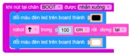

2. 5. Các lỗi di chuyển
==================

Khi nạp chương trình, Robot không báo lỗi nhưng không di chuyển tự động sang ngang hoặc các hướng khác, bạn hãy tham khảo các lỗi sau và khắc phục.

5.1. Robot không đi ngang được theo centimet
-----------

Nguyên nhân:
    - Do động cơ robot không tính toán được quảng đường đi ngang theo centimet một cách tương đối chính xác.

Cách xử lý:
    - Phải đổi thành đơn vị giây để robot di chuyển

5.2. Robot điều khiển được nhưng chạy tự động chỉ nhích 1 lần rồi đứng im
-------------

Nguyên nhân:
    - Khi chạy chương trình tự động thì cần phải có câu lệnh để tạm dừng nhận tín hiệu từ tay cầm điều khiển.

    
Cách xử lý:
    - Lỗi này xảy ra lúc lập trình, khi lập trình tự động thì cần phải có 2 câu lệnh tạm dừng chế độ gamepad, sau khi chạy chương trình xong thì dùng lệnh bật lại chế độ gamepad.

