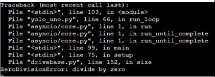

2. 3. Báo lỗi ZeroDivisionError: divide by zero
==================
Khi nạp chương trình tham khảo, robot không hoạt động kiểm tra lỗi tại màn hình nhập lệnh thì thấy được báo lỗi.

Nguyên nhân:
    - Do thiết lập tạo động cơ encoder nhưng chưa thêm lệnh bật encoder cho động cơ tương ứng (các động cơ gắn cổng E1-E2).
    - Dùng dư lệnh bật Encoder cho các động cơ dùng cổng từ M1-M4.

..  figure:: images/orc03.jpg
    :scale: 100%
    :align: center 

Cách xử lý:
    - Bổ sung 2 khối lệnh này vào phía dưới 2 câu lệnh tạo động cơ E1 và E2.
    - Xóa bỏ các câu lệnh bật emcoder dư thừa của chương trình.

    
