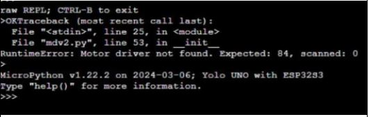
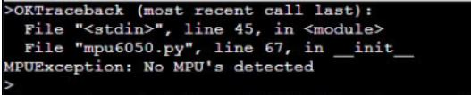
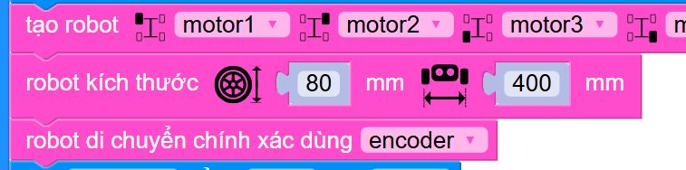

2. 6. Các lỗi driver của ORC Hub
==================

Khi nạp chương trình, robot không hoạt động, màn hình nhập lệnh hiện lỗi như các trường hợp sau.

6.1. Motor driver not found
-----------

Nguyên nhân:
    - Đây là lỗi liên quan đến giao tiếp driver của mạch, lỗi này khi phát hiện cần nhờ các anh kỹ thuật hỗ trợ

6.2. No MPU’s detected
-------------

Nguyên nhân:
    - Driver giao tiếp giữa mạch và cảm biến góc bị lỗi.

    
Cách xử lý:
    - Cách khắc phục tạm thời là không dùng cảm biến góc, xóa câu lệnh tạo cảm biến góc đi và chọn di chuyển chính xác bằng encoder.

