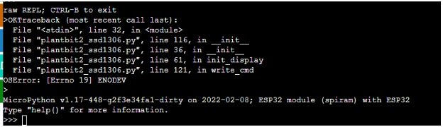
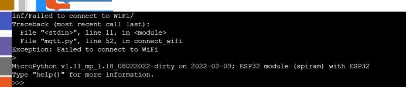
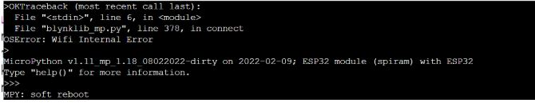
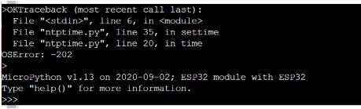
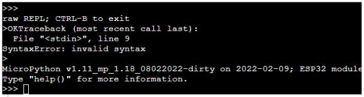
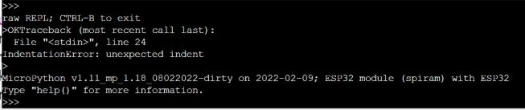

3. 3. Các mã lỗi thường gặp và cách xử lý
==================
**1. Import Error: no module named ‘...’ hoặc NameError: name … not defined**
--------
Nguyên nhân: 
    - Chưa tải thư viện cần thiết cần có trong chương trình vào thiết bị
    - Nạp chương trình khi thiết bị chưa khởi động xong (Reset Yolo:Bit và chờ khởi động xong để nạp code)

Cách xử lý:
    - Cài đặt thư viện bằng cách vào menu Tải thư viện
    ..  figure:: images/loi_module7.JPG
        :scale: 100%
        :align: center 

**Sau khi tải thư viện, chúng ta có thể reset lại Yolo:Bit bằng cách nhấn nút Reset phía sau mạch và chạy lại chương trình**
-----------
**2. OSError: [ErrNo 19] ENODEV - Không tìm thấy thiết bị X**
-----------

Nguyên nhân: 
    - Chương trình đọc thiết bị I2C (như màn hình LCD hay các cảm biến sử dụng giao thức I2C) nhưng không tìm thấy thiết bị, khiến chương trình bị lỗi và dừng

Cách xử lý:
    - Kiểm tra xem module đã kết nối vào mạch mở rộng hay chưa
    - Nếu module đã kết nối thì cần kiểm tra cổng kết nối có dùng đúng cổng I2C hay không. 
    Trên mạch mở rộng có 2 cổng I2C chuyên dùng để kết nối các module I2C như hình:

    ..  figure:: images/loi_module9.JPG
        :scale: 100%
        :align: center 

**3. Exception: Failed to connect to WiFi - Kết nối Wifi thất bại**
-----------

Nguyên nhân: 
    - Yolo:Bit không thể kết nối đến mạng WiFi theo thông tin trong chương trình

Cách xử lý:
    - Cần kiểm tra tên và mật khẩu của mạng WiFi đã nhập chính xác hay chưa (không dùng mạng Wifi 5Ghz)
    - Kiểm tra xem tên WiFi có các ký tự đặc biệt hay dài quá không, vì điều này có thể gây khó khăn cho Yolo:Bit khi quét và kết nối WiFi. 
    - Có thể dùng điện thoại có 4G để phát WiFi với tên WiFi và mật khẩu đơn giản để dễ kết nối (đặt tên wifi và mật khẩu đơn giản để dễ dàng kết nối)

**4. OSError: 23 hoặc OSError: Wifi Internal Error**
-----------

Nguyên nhân: 
    - Do chạy đi chạy lại chương trình kết nối WiFi nhiều lần, khiến cho mạch Yolo:Bit bị treo tính năng WiFi

Cách xử lý:
    - Nhấn nút Reset phía sau mạch Yolo:Bit để reset và chạy lại chương trình

**5. OSError: -202 hoặc OSError: 118**
-----------

Nguyên nhân: 
    - Gọi các lệnh cập nhật thời gian từ Internet bằng NTP trong khi Yolo:Bit chưa được kết nối WiFi

Cách xử lý:
    - Cần thêm các lệnh để kết nối WiFi trước khi cập nhật giờ từ Internet bằng NTP

**6. IndentationError: unexpected indent hoặc SynctaxError: invalid synctax**
-----------

Nguyên nhân: 
    - Do viết chương trình bằng Python nhưng sai cú pháp hoặc canh lề các dòng code không đúng theo yêu cầu của ngôn ngữ Python
    - Phần mềm sinh code sai khi nạp chương trình.

Cách xử lý:
    - Cần kiểm tra lại chương trình để đảm bảo các dòng lệnh Python được canh lề cho đúng và cú pháp chính xác.
    - Với trường hợp phần mềm sinh code sai thì có thể reset lại mạch, tải lại app lập trình và nạp lại chương trình.

