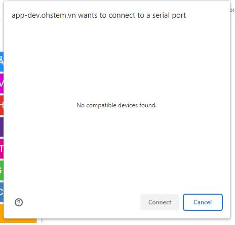

3. 1. Lỗi máy tính không kết nối với Yolo:Bit 
==================
Khi nhấn nút kết nối thì không xuất hiện ra cổng COM của Yolo:Bit để kết nối:

Nguyên nhân: 
    - Đối với Yolo:Bit phiên bản version 4: Chưa cài đặt driver cho thiết bị trên máy tính, cách khắc phục:Cài đặt driver theo hướng dẫn http://ohstem.vn/driver 
    Lưu ý cần phải giải nén file tải về trước khi cài đặt, cách giải nén file.
    - Đối với phiên bản Yolo:Bit version 5: Kiểm tra lại hoạt động của Yolo:Bit, kiểm tra lại cáp USB và cổng cắm, máy tính dùng hệ điều hành Windows10/11 sẽ tự động nhận driver.

**Đã cài đặt driver nhưng vẫn không thể kết nối đến Yolo:Bit**
-----------
Cách khắc phục:
    - Thử khởi động lại máy tính lại máy tính
    - Thử đổi sang cổng USB khác trên máy tính Kiểm tra xem có sử dụng cáp USB đi kèm sản phẩm không. Nếu bạn sử dụng cáp USB type C khác, hãy kiểm tra xem cáp đang dùng có hỗ trợ truyền nhận dữ liệu không, vì một số dây cáp USB chỉ có tác dụng sạc
