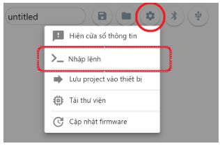
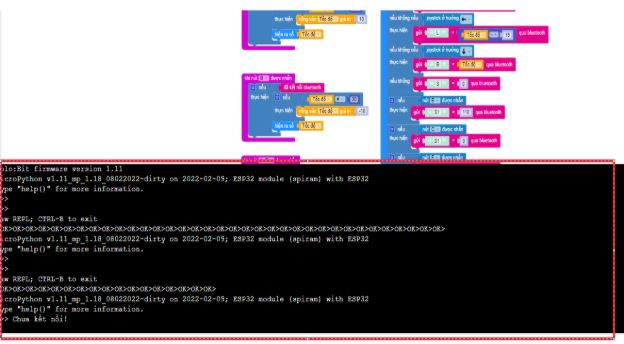

3. 2. Lỗi nạp chương trình nhưng thiết bị không hoạt động 
==================

Nguyên nhân: 
    - Chương trình xây dựng không đúng logic, chương trình bị lỗi, không chạy được.

Cách xử lý:
    - Chia sẻ link chương trình vào nhóm nhờ tư vấn kỹ thuật bằng tính năng chia sẻ chương trình
    ..  figure:: images/loi_module3.JPG
        :scale: 100%
        :align: center 
    - Bật cửa sổ Nhập lệnh và chụp hình kết quả khi chạy chương trình.
    Thao tác bật nhập lệnh như sau:

    

**Chia sẻ chương trình và màn hình báo lỗi để bộ phận hỗ trợ kiểm tra lỗi nhanh thuận tiện hơn**
-----------
