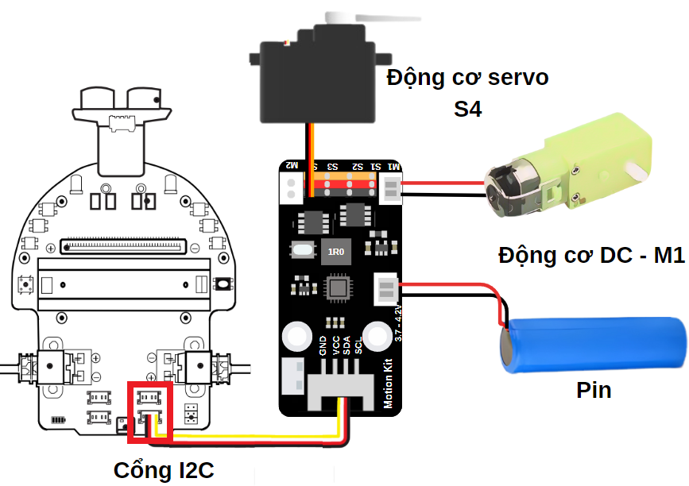
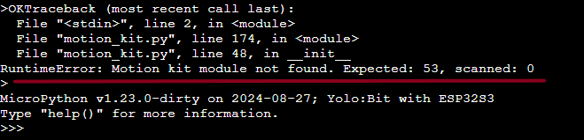

1. 7. Lỗi khi dùng Rover với Motion kit
==================

Motiom kit là 1 module giúp mở rộng cơ cấu nhỏ gọn cho robot Rover gồm có 4 cổng servo mở rộng, 2 động cơ DC. Khi kết nối và lập trình cho robot Rover, robot không hoạt động, chúng ta sẽ tham khảo các cách xử lý sau:

**Lỗi cắm sai cổng kết nối**
-------
- Khi dùng motion kit với robot Rover, chúng ta phải lưu ý cắm đúng cổng giao tiếp. Chúng ta sẽ phải bắt buộc cắm ở 1 trong 2 cổng kết nối như hình

Kiểm tra lại phần cắm dây giao tiếp trên mạch rover xem chúng ta đã cắm đúng cổng kết nối chưa nhé.

**Báo lỗi khi nạp chương trình**:
------
Khi bạn đã cắm đúng kết nối nhưng robot vẫn không hoạt động, bạn thử thao tác như hướng dẫn sau https://docs.ohstem.vn/en/latest/FaQs/loi_cua_module/module/loinapcodekhongchay.html để tìm mã lỗi.
Nếu mã lỗi báo giống như hình bên dưới thì đây là lỗi do mạch motion kit, bạn cần liên hệ OhStem hỗ trợ.

