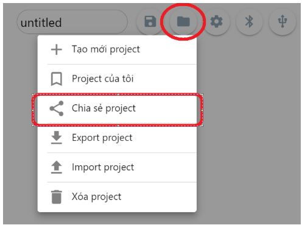

4. Các thao tác cơ bản với OhStem App
==================
**1. Thao tác chia sẻ chương trình:**
--------

Để chia sẻ chương trình cho người khác, chúng ta sẽ phải thao tác như hình để chia sẻ chương trình

Sau đó copy đường link chương trình và gửi cho bạn bè để chia sẻ.

**2. Thao tác cập nhật thư viện mới**
-----------

OhStem App thường có các đợt update thư viện cho các thiết bị, các đợt update này sẽ thêm các thư viện hỗ trợ tốt hơn, khắc phục các tình trạng lỗi code.
Để cập nhật phiên bản thư viện mới, chúng ta sẽ thao tác như sau:
    - Ở giao diện lập trình, bấm vào mục **"MỞ RỘNG"** hoặc **"THƯ VIỆN"** 
    - Tìm đến thư viện cần update và bấm vào nút X 
        ..  figure:: images/ohstemapp1.JPG
            :scale: 100%
            :align: center
    - Sau khi đã gỡ, chúng ta thao tác ấn tổ hợp phím tắt **CTRL + F5** để tải lại trang app lập trình.
    - Sau khi đã tải lại trang lập trình, chúng ta sẽ kết nối với thiết bị và tải lại thư viện mở rộng.       
