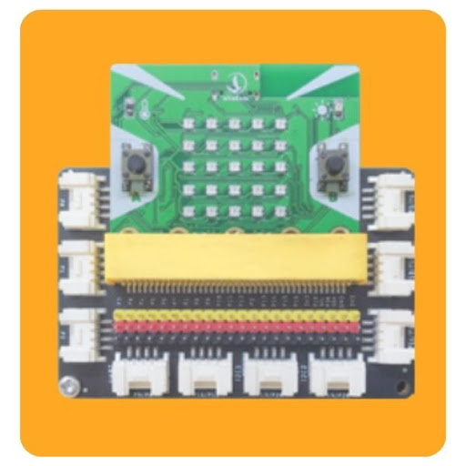
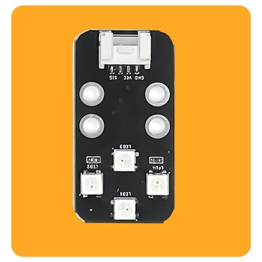
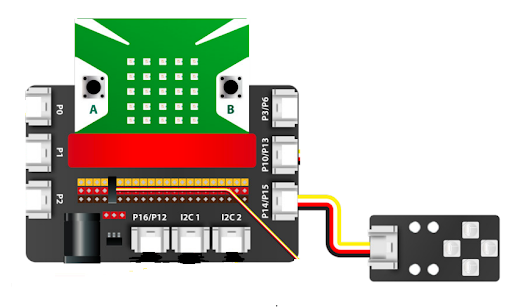
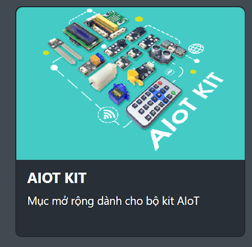
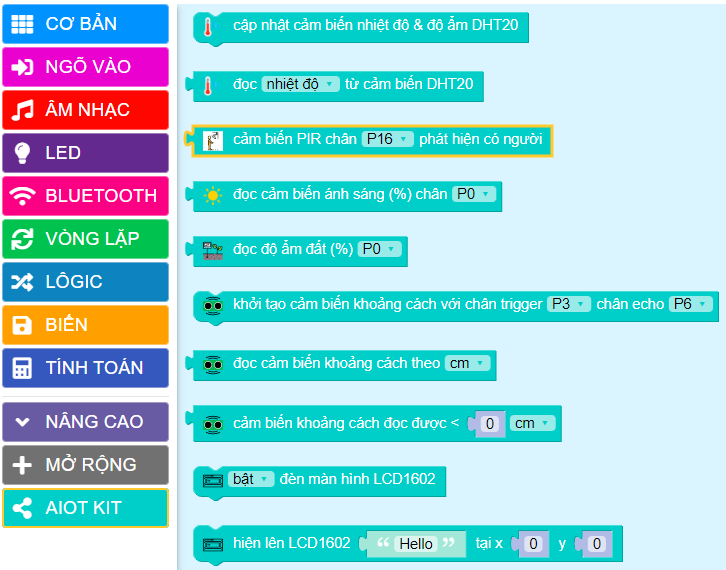
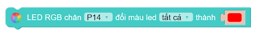
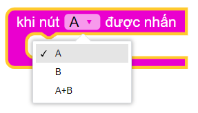
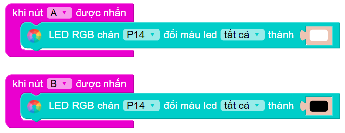
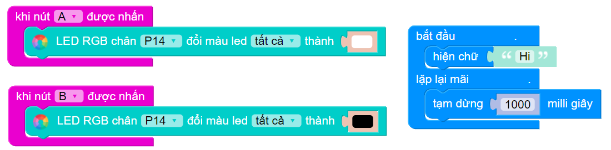

4. Bật tắt đèn bằng nút nhấn trên Yolo:Bit
=====================================

1. Mục tiêu 
----------
---------------

Một trong những thiết bị đầu tiên mà chúng ta sẽ làm quen là đèn chiếu sáng RGB (còn gọi là module 4 LED RGB). 

RGB là cụm từ viết tắt của Red - Green - Blue (tương ứng với 3 màu là đỏ, xanh lá và xanh dương). Đây là 3 màu cơ bản dùng để phối ra rất nhiều màu trong thực tế. Do đó, với thiết bị này, bạn có thể sáng tạo ra nhiều ánh sáng đẹp mắt cho ứng dụng của mình.

2. Thiết bị cần dùng 
-------
-------------

- Mạch Yolo:Bit 

- Mạch mở rộng Yolo:Bit

| 
- Module 4 LED RGB 

| 

3. Kết nối 
-------
------------

Trên mạch mở rộng của Yolo:Bit, mỗi khe cắm đều sẽ có tên của chân kết nối. Đây là thông tin quan trọng cho việc lập trình sau này. 

Module 4 LED RGB được nối với chân P14/P15 của Yolo:Bit, như hình minh họa bên dưới:

| 
Nhờ các dây điện đã chuẩn hóa về nguồn đất và tín hiệu điều khiển, bạn không cần phải lo lắng về việc kết nối các thiết bị với nhau. Các dây kết nối cũng chỉ có 1 chiều cắm, nhằm hạn chế tối đa việc cắm ngược, gây chập nguồn và hư hỏng thiết bị. Đây là một lợi thế vô cùng lớn của hệ thống mạch điện khi đã được chuẩn hóa.

4. Lập trình 
-------
------

- **Thêm thư viện lập trình AIoT**

Đèn 4 LED RGB là một thiết bị tích hợp. Cụ thể, nó được điều khiển bằng tín hiệu hình xung, vốn là một khái niệm khá phức tạp trong việc lập trình dành cho các thiết bị điện tử. 

Do đó, để thuận lợi cho người dùng, OhStem có hỗ trợ thư viện lập trình dùng cho các thiết bị ngoại vi của Yolo:Bit, có tên là **AIoT KIT**. Hơn nữa, bộ thư viện này còn sẽ được sử dụng xuyên suốt trong các phần hướng dẫn tiếp theo. 

Dựa vào thư viện này, bạn có thể lập trình với rất nhiều thiết bị cao cấp khác, như quạt (motor), cảm biến nhiệt độ và độ ẩm không khí, cảm biến độ ẩm đất hay các công tắc điện tử, màn hình LCD. 

| 

Để thêm thư viện AIoT KIT, bạn tiến hành kết nối Yolo:Bit với máy tính bằng dây USB. Sau đó, bạn chọn vào **MỞ RỘNG >>tìm kiếm cụm từ AIoT KIT**, giao diện sẽ hiển thị hình ảnh thư viện AIoT KIT như hình trên. 

Sau khi nhấn chọn vào thư viện này, một nhóm lệnh mới sẽ được thêm vào môi trường lập trình trực tuyến, như hình dưới:

|
- **Giới thiệu khối lệnh**

Chúng ta sẽ sử dụng câu lệnh bên dưới để điều khiển đèn RGB:

|
Câu lệnh này có 3 phần tùy chọn có thể thay đổi:

    + Chân kết nối: Bạn cần phải chọn đúng chân mà đèn 4 LED RGB đang kết nối với Yolo:Bit. Như trong bài này, chân kết nối là P14
    + Vị trí đèn: Trên thiết bị có tất cả 4 đèn, bạn có thể chọn điều khiển riêng lẻ từng đèn, hoặc đơn giản là chọn tất cả 4 đèn
    + Màu đèn: Có rất nhiều màu để bạn chọn (lưu ý: màu đen được dùng để tắt đèn)

- **Lập trình**

Để làm một ví dụ minh họa đơn giản, chúng ta sẽ sử dụng nút A và B trên mạch Yolo:Bit để điều khiển bật / tắt đèn:

    + Nhấn nút A: Bật đèn màu trắng
    + Nhấn nút B: Tắt đèn

Sau khi đã thêm đầy đủ thư viện, chúng ta bắt đầu lập trình cho mạch Yolo:Bit. Chúng ta sẽ sử dụng khối lệnh sự kiện **khi nút A được nhấn** trong mục **NGÕ VÀO**, như hình minh họa dưới:

|

Đây là khối lệnh có thể chọn lựa được, với 3 tùy chọn khác nhau:
        
    + Nút A
    + Nút B
    + Khi nhấn 2 nút A và B cùng lúc. 

Với yêu cầu của đề bài, chúng ta chỉ cần 2 khối cho 2 nút A và B mà thôi. Chương trình gợi ý sẽ như sau:

|

Chương trình hoàn chỉnh: 

|

5. Chương trình mẫu 
-------
------------

- Bật tắt đèn với nút nhấn trên Yolo:Bit: `Tại đây <https://app.ohstem.vn/#!/share/yolobit/2EW4pHV58xpGRUl5XoNYy1735Ip>`_

