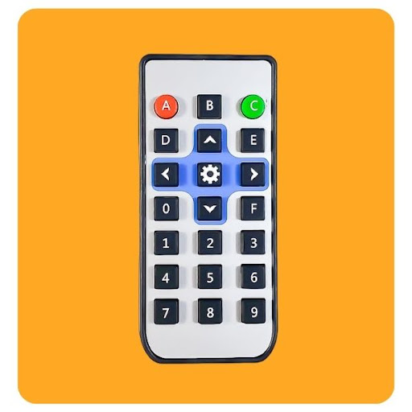
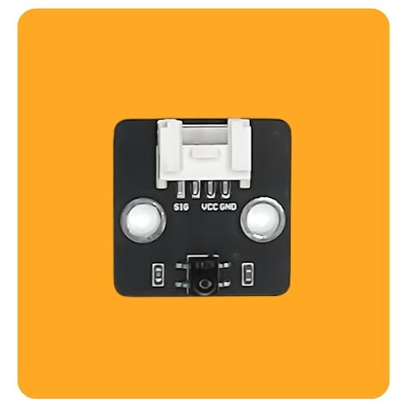
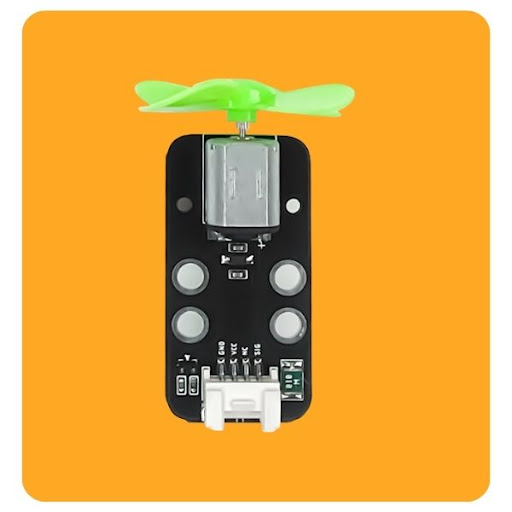
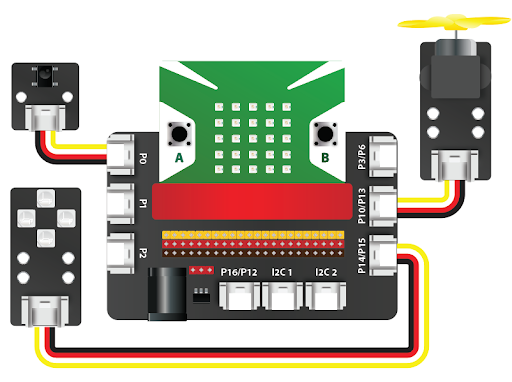
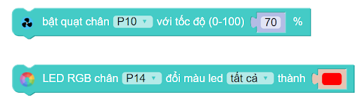
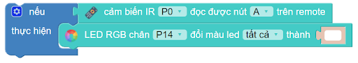
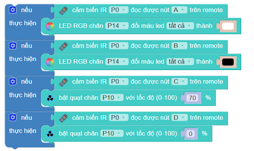
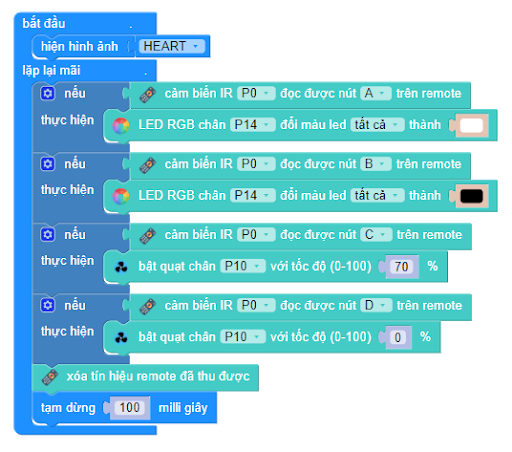

6. Điều khiển đèn và quạt từ xa 
===================================

1. Mục tiêu 
----------
---------------

Trong phần này, chúng ta sẽ cùng xây dựng một hệ thống gồm đèn và quạt có thể điều khiển từ xa thông qua remote hồng ngoại.

2. Thiết bị cần dùng 
-------
-------------

- Mạch Yolo:Bit
- Mạch mở rộng Yolo:Bit.

.. image:: images/4.1.jpg
    :width: 300px
    :align: center
| 
- Remote

|
- Mắt đọc tín hiệu hồng ngoại IR

|
- Module 4 LED RGB 

.. image:: images/4.2.jpg
    :scale: 40 %
    :align: center
| 
- Quạt mini

|

3. Kết nối 
-------
------------

- Kết nối module đèn 4 LED RGB vào cổng P14/15
- Kết nối quạt mini vào cổng P10/13
- Kết nối mắt thu hồng ngoại vào cổng P0

| 

4. Lập trình 
-------
----------

- **Giới thiệu khối lệnh**

Để sử dụng cặp thiết bị remote IR và mắt thu tín hiệu IR, chúng ta sẽ sử dụng khối lệnh sau trong danh mục AIoT:

|   
Để sử dụng quạt mini và đèn 4 LED RGB, ta sử dụng các khối lệnh sau:

| 

- **Yêu cầu cơ bản của dự án:**

    - Nếu nhấn nút A, đèn sẽ bật màu trắng
    - Nếu nhấn nút B, đèn sẽ tắt (tương ứng với màu đen)
    - Nếu nhấn nút C, quạt sẽ bật
    - Nếu nhấn nút D, quạt sẽ tắt

- **Lập trình**

Ta cùng lập trình cho điều kiện đầu tiên: Nếu như cảm biến IR (mắt thu hồng ngoại) đọc được tín hiệu nút A từ remote truyền đến, đèn 4 LED RGB sẽ bật. Chương trình sẽ như sau:

|
Bạn hãy làm lần lượt lập trình cho các chức năng tiếp theo rồi ghép lại với nhau, chúng ta sẽ có chương trình như hình dưới:

|
Sau khi Yolo:Bit đã nhận được tín hiệu từ cảm biến và xử lý, chúng ta sẽ phải xóa tín hiệu remote cũ để nhận lệnh mới chính xác hơn. Chúng ta sẽ dùng khối lệnh dưới:

|
Ghép các câu lệnh trên lại, ta sẽ được chương trình hoàn chỉnh cho hệ thống điều khiển đèn và quạt từ xa thông qua remote như hình:

|

5. Chương trình mẫu 
-------
------------

- Điều khiển đèn quạt từ xa: `Tại đây <https://app.ohstem.vn/#!/share/yolobit/2EWInautetLxsci9ezVW2A7l6gk>`_

