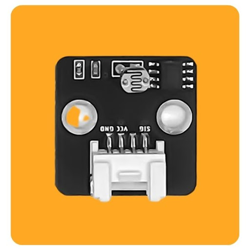
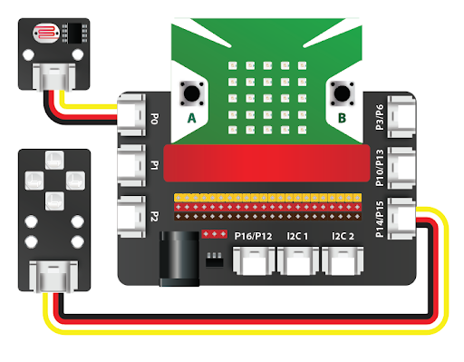
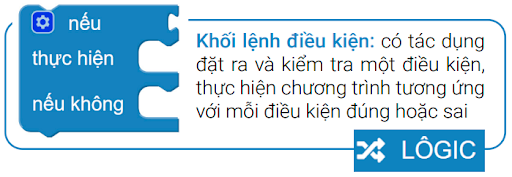
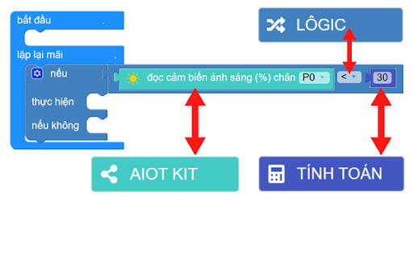
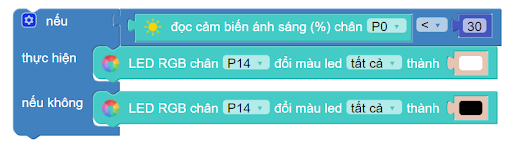

5. Đèn thông minh
=================

1. Mục tiêu 
----------
---------------

Chúng ta hãy cùng lập trình một chiếc đèn thông minh, có thể bật tắt tự động dựa vào ánh sáng nhé. Cụ thể, khi trời tối (độ sáng < 30%) thì đèn sẽ tự bật. Ngược lại, khi trời sáng thì đèn sẽ tự tắt. 

2. Thiết bị cần dùng 
-------
-------------

- Mạch Yolo:Bit
- Mạch mở rộng Yolo:Bit.

.. image:: images/4.1.jpg
    :width: 300px
    :align: center
| 
- Module 4 LED RGB 

.. image:: images/4.2.jpg
    :scale: 40 %
    :align: center
| 
- Cảm biến ánh sáng

| 

3. Kết nối 
-------
------------

- Kết nối cảm biến ánh sáng vào cổng P0
- Kết nối đèn 4 LED RGB vào cổng P14

| 

4. Lập trình 
-------
----------

- **Giới thiệu khối lệnh**

Trong phần này, chúng ta sẽ dùng đến khối lệnh điều kiện trong mục LOGIC:

| 

- **Lập trình**

Đầu tiên, chúng ta sẽ đặt điều kiện nếu trời tối (độ sáng < 30) như bên dưới. Các khối lệnh được lấy trong từng danh mục tương ứng:

| 
Lập trình bật và tắt đèn LED RGB tùy theo từng trường hợp như yêu cầu:

| 

5. Chương trình mẫu 
-------
------------

- Đèn thông minh: `Tại đây <https://app.ohstem.vn/#!/share/yolobit/2EWGNO7AUl2vRpp3gmYvx0AefQD>`_

