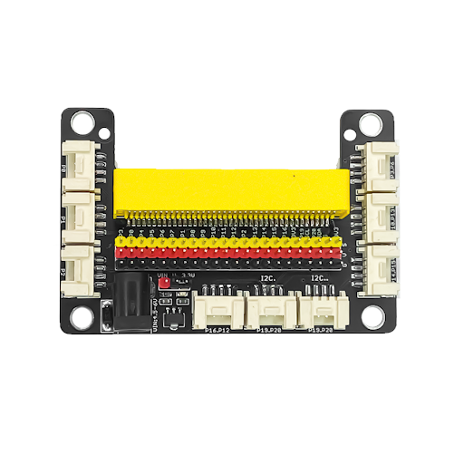
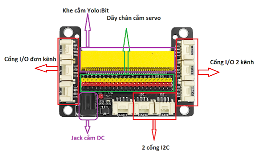
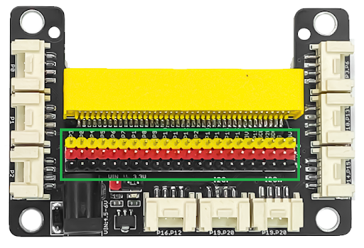
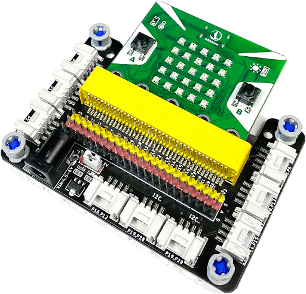

2. Tìm hiểu mạch mở rộng Yolo:Bit 
=======================

1. Giới thiệu
-----------
------------

Yolo:Bit Extend Shield (Mạch mở rộng Yolo:Bit) là một bảng mạch mở rộng mang tính đột phá dành riêng cho Yolo:Bit. Mạch này có công dụng kết nối các chân của mạch Yolo:Bit ra các chân I/O, I2C, SPI của mạch mở rộng. 

| 

Bạn có thể sử dụng nguồn từ Yolo:Bit hoặc nguồn ngoài để cấp nguồn cho hệ thống hoạt động. Tuy nhiên, **nếu cần sử dụng các cảm biến cần nguồn mạnh hơn hoặc động cơ Servo, bạn nên sử dụng nguồn ngoài** (bằng cách cấp nguồn vào jack cắm DC). Mạch có thể chuyển đổi mức điện áp cho một số cổng GPIO, giúp Yolo:Bit có thể điều chỉnh và làm việc được với các cảm biến 5V.

| 

2. Phần cứng 
----------
-------------

- Điện áp đầu vào: 

    + 3.3V (khi cấp nguồn thông qua Yolo:Bit)
    + 5 - 9V (khi cấp nguồn thông qua jack cắm DC trên mạch mở rộng)

- Mở rộng tất cả các cổng GPIO: 

    + Bên dưới mỗi cổng ở hàng chân cắm có các chân cho VCC và GND. Các chân này được phân biệt bằng các màu khác nhau, giúp bạn dễ dàng kết nối module mở rộng của mình mà không sợ bị cắm nhầm chân tín hiệu.
    + Mạch mở rộng đã tích hợp sẵn 2 cổng I2C, giúp thuận tiện cho việc kết nối các cảm biến dùng giao thức I2C.

- Tương thích với chuẩn kết nối Grove.

3. Thông tin chi tiết 
-------
-------------

Mạch mở rộng có dãy cổng GVS tiêu chuẩn, dùng để sử dụng các module mở rộng ngoài, động cơ Servo,... 

| 

Mỗi hàng cổng  I/O có các chân cho VCC và GND. Các chân này được phân biệt bằng các màu khác nhau, giúp bạn dễ dàng kết nối module mở rộng của mình mà không sợ bị cắm nhầm chân tín hiệu.

**Lưu ý:**  Để sử dụng mạch mở rộng Yolo:Bit này, bạn cần có mạch máy tính mini Yolo:Bit đi kèm.

| 

