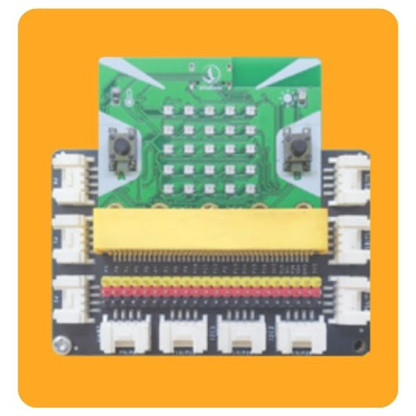

7. Hiển thị thông tin lên màn hình LCD 
=====================================

1. Mục tiêu 
----------
---------------

Trong bài học này, chúng ta sẽ cùng lập trình để hiển thị ký tự lên màn hình LCD nhé!

2. Thiết bị cần dùng 
-------
-------------

- Mạch Yolo:Bit
- Mạch mở rộng Yolo:Bit.

|

- Màn hình LCD1602

|

3. Kết nối 
-------
------------

- Kết nối màn hình LCD với cổng I2C

.. image:: images/7.2.png
    :width: 400px
    :align: center
| 
Do I2C là một dạng giao tiếp đặc biệt, nên chúng ta chỉ có thể cắm dây nối giữa màn hình LCD và mạch mở rộng tại chân cắm I2C (như hình minh họa). Trên mạch mở rộng của Yolo:Bit chỉ hỗ trợ tối đa 2 kết nối I2C cùng một lúc.

4. Lập trình 
-------
----------

Để hiển thị dữ liệu lên màn hình LCD, bạn hãy sử dụng 1 cặp gồm 2 câu lệnh trong nhóm AIoT KIT, như hình dưới:

|

Câu lệnh đầu tiên sẽ xóa toàn bộ màn hình, trong khi câu lệnh thứ 2 sẽ được dùng để hiển thị thông tin lên màn hình LCD tại tọa độ x và y:

    - x (cột): có giá trị từ 0 đến 15 - tương ứng cho 16 cột
    - y (hàng): có giá trị từ 0 đến 1 - tương ứng cho 2 dòng

Bạn có thể ghép 2 khối lệnh trên vào phần bắt đầu của LCD để xem thông tin được hiển thị ra như thế nào nhé!

.. image:: images/7.4.png
    :scale: 100 %
    :align: center
|

Trong trường hợp không thấy xuất hiện chữ trên màn hình LCD, bạn cũng đừng hoang mang và kết luận rằng chương trình bị lỗi. Thông thường, điều này xảy ra do độ tương phản của màu chữ và màu nền chưa hợp lý. 

Để khắc phục vấn đề này, bạn có thể sử dụng một tuốc nơ vít nhỏ, vặn một đầu vít có ghi chữ CONTRAST (như hình minh họa bên dưới), bạn sẽ thấy chữ dần dần hiện lên.

.. image:: images/7.5.png
    :scale: 100 %
    :align: center
|
5. Chương trình mẫu 
-------
------------

- Hiển thị thông tin lên LCD : `Tại đây <https://app.ohstem.vn/#!/share/yolobit/2EWLHRl4LlzJmwykpdV01HarLS5>`_

