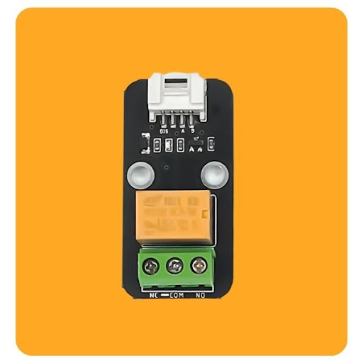
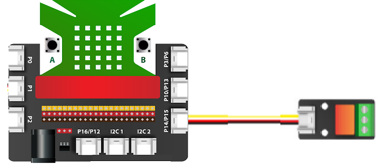
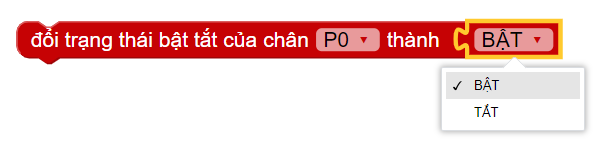
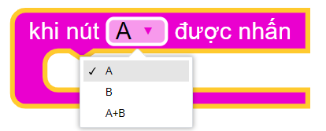
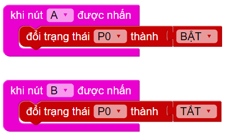
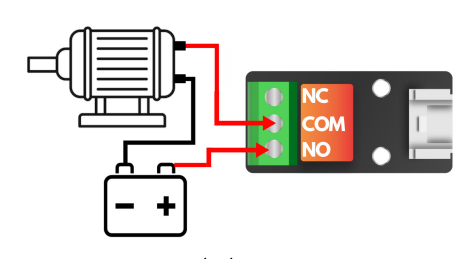

16. Bật tắt Relay 
==========

1. Mục tiêu 
----------
---------------

Relay là linh kiện điện tử hay dùng để điều khiển các thiết bị điện xoay chiều. Nhìn chung, Relay có cách hoạt động như một công tắc điện tử. Ở dự án này, chúng ta sẽ học cách điều khiển các thiết bị điện xoay chiều với Relay.

2. Thiết bị cần dùng 
-------
-------------

- Mạch Yolo:Bit
- Mạch mở rộng Yolo:Bit.

.. image:: images/4.1.jpg
    :width: 300px
    :align: center
|

- Công tắc Relay

|

3. Kết nối 
-------
------------

- Kết nối relay vào cổng P14/15

|

4. Lập trình 
-------
----------

Tận dụng 2 nút nhấn A và B có sẵn trên mạch Yolo:Bit, chúng ta có thể điều khiển trạng thái bật/tắt của Relay dễ dàng. Khối lệnh điều khiển Relay nằm trong danh mục **CHÂN CẮM**:

|

Bên cạnh đó, chúng ta sẽ sử dụng thêm khối lệnh sự kiện khi nút A được nhấn như hình:

|

Đây là khối lệnh có thể chọn lựa được, với 3 tùy chọn khác nhau, dành cho nút A, nút B và khi nhấn 2 nút cùng lúc. Với yêu cầu của đề bài, chúng ta chỉ cần 2 khối cho 2 nút A và B mà thôi. Chương trình gợi ý khi nhấn nút sẽ như sau:

|

Để kết nối với thiết bị sử dụng dòng điện xoay chiều, bạn nên nối dây theo sơ đồ sau (lấy ví dụ 1 máy bơm AC):

|

5. Chương trình mẫu 
-------
------------

- Bật tắt Relay : `Tại đây <https://app.ohstem.vn/#!/share/yolobit/2IG5fWtU77w9oscCE2XUFwxmopo>`_

