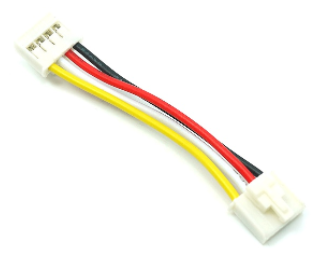

Chân cắm
==========

|

|

xController có thiết kế sẵn 6 cổng mở rộng, được đánh số từ cổng 1 đến cổng 6. Mỗi cổng mở rộng này có 4 chân tín hiệu. Bạn có thể thấy 4 chân tín hiệu này thông qua dây cáp tín hiệu đi kèm bộ kit. Dây cáp này có 4 sợi với 4 màu khác nhau:

   
   Vàng: Chân IO tín hiệu số 1. Phần lớn các module đơn giản như đèn LED hay nút nhấn sẽ sử dụng chân tín hiệu này.
   
   Trắng: Chân IO tín hiệu số 2. Chủ yếu sử dụng bởi các module phức tạp như màn hình LCD, đòi hỏi phải sử dụng cả 2 tín hiệu để truyền nhận.
   
   Đỏ: Chân nguồn cực dương, 3.3V.
   
   Đen: Chân nguồn cực âm, 0V, còn gọi là Ground.

|

|
---------

.. toctree::
   :maxdepth: 1

   ad-pin/xbot_pin_read_analog.rst
   ad-pin/xbot_pin_write_analog.rst
   ad-pin/xbot_pin_read_digital.rst
   ad-pin/xbot_pin_pulse_in.rst
   ad-pin/xbot_pin_write_digital.rst
   ad-pin/xbot_pin_set_pull.rst
   ad-pin/xbot_pin_onoff_value.rst