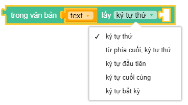

Lấy một kí tự trong 1 văn bản theo vị trí
==========

Lấy một kí tự trong 1 văn bản theo vị trí của kí tự đó trong văn bản. Kí tự đầu tiên trong văn bản là 1

Ví dụ
----------------------

Kết quả trả về là kí tự ``O``

