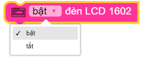
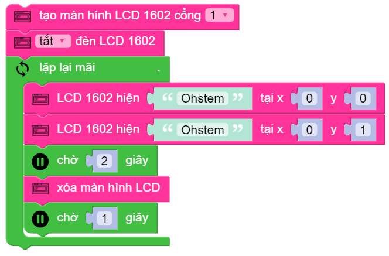

LCD 1602 Module
=============================================

Chức năng chính module LCD 1602

.. function:: lcd1602 = LCD1602(PORT)
----------------------

Khai báo *PORT* đã được kết nối với LCD 1602.

*PORT* Có giá trị từ ``1 ~ 6`` tương ứng từ PORT 1 đến PORT 6 của xController.

.. function:: lcd1602.backlight_on|backlight_off()
----------------------

Bật/tắt đèn nền của màn hình.

.. function::
     lcd1602.move_to(X, Y)
     lcd1602.putstr(TEXT)
----------------------

Di chuyển con trỏ đến vị trí muốn xuất hiện kí tự, và in dòng kí tự ``TEXT`` lên màn hình. ``TEXT`` ghi không có dấu. Trogn đó:

     - *X* là tọa độ theo chiều ngang.
     - *Y* là tọa độ theo chiều dọc.

.. function:: lcd1602.clear()
----------------------

Xóa kí tự trên màn hình.

Ví dụ
----------------------
Hiển thị kí tự trên màn hình LCD 1602

