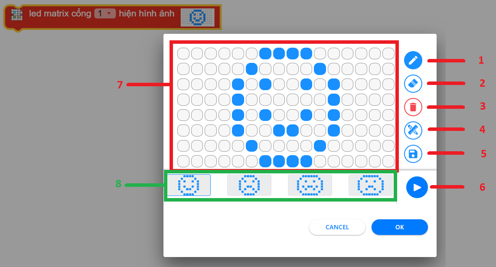

LED Matrix
=============================================

Chức năng chính của module LED Matrix.

.. function:: led_matrix.show(PORT, Image.IMAGE)
----------------------

.. image:: images/led-matrix-2.png
    :width: 320
    :align: center

Hiển thị lên màn hình LED Matrix những hình ảnh có sẵn hoặc vẽ.

Giao diện trình chỉnh sửa hình ảnh hiển thị lên Led Matrix:

Trong đó:

    1: Bút vẽ - Chọn rồi nhấn vào các chấm trắng trên khung vẽ 7. Khi chấm trắng chuyển sang chấm xanh tức là led led tại vị trị trí đó sẽ sáng.

    2: Tẩy - Chọn rồi xóa các chấm xanh trên khung vẽ 7.

    3: Delete - Xóa toàn bộ nội dung trên khung vẽ 7.

    4: Thước đo - Bật hoặc tắt thước đo để dễ dàng xác định vị trí đèn led cần sáng hoặc tắt.

    5: Lưu - Lưu lại nội dung bạn vừa vẽ. Nội dụng đã lưu sẽ xuất hiện trong danh sách 8.

    6: Play/Pause - Chạy thử hoặc dừng hiển thị nội dung trên module để kiểm tra kết quả.

    7: Khung vẽ - Đây là nơi bạn tạo nội dung cho Lex Matrix.

    8: Danh sách nội dung: Nơi đây chứa các nội dung có sẵn, cũng như các nội dung mà bạn đã khởi tạo. Rê chuột hoặc kéo qua trái phải để xem thêm nội dung.

.. function:: led_matrix.show(PORT, TEXT)
----------------------

.. image:: images/led-matrix-1.png
    :width: 320
    :align: center

Hiển thị lên màn hình LED Matrix những văn bản bất kì, trong đó *TEXT* là văn bản bạn muốn hiển thị. ``TEXT`` ghi không có dấu.

Ví dụ:
----------------------
Hiển thị hình trái tim và chữ OHSTEM lên màn hình LED Matrix

.. image:: images/led-matrix-5.png
    :width: 480
    :align: center
