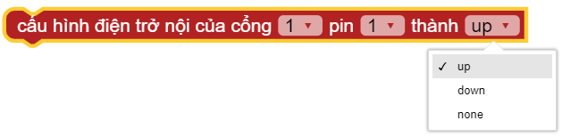

Pins
=============================================

Chức năng chính các chân Pins

.. function:: pin[X][Y].write_digital((STATE))
----------------------

    
Đổi trạng thái BẬT|TẮT của 1 PORT, trong đó:

    - Cổng: Có giá trị từ ``1 ~ 6`` đại diện PORT 1 đến PORT 6 của xController.
    - Pin: Có giá trị là ``1|2`` tương ứng với tín hiệu 1 hoặc tín hiệu 2 đối với mỗi PORT. Đối với một số module thì mặc định là 1.
    - *STATE* Có giá trị là ``1`` hoặc ``0`` tương ứng với trạng thái TẮT|BẬT PORT.

.. function:: pin[X][Y].read_digital()
----------------------

Trả về giá trị ``0`` hoặc ``1``, trong đó:

    - Cổng: Có giá trị từ ``1 ~ 6`` đại diện PORT 1 đến PORT 6 của xController.
    - Pin: Có giá trị là ``1`` hoặc ``2`` tương ứng với tín hiệu 1 hoặc tín hiệu 2 đối với mỗi PORT. Đối với một số module thì mặc định là 1.

.. function:: pin11.write_analog(STATE)
----------------------

.. image:: images/pin-2.png
    :width: 400
    :align: center

Đổi trạng thái BẬT|TẮT của 1 PORT, trong đó:

    - Cổng: Có giá trị từ ``1 ~ 6`` đại diện PORT 1 đến PORT 6 của xController.
    - Pin: Có giá trị là ``1`` hoặc ``2`` tương ứng với tín hiệu 1 hoặc tín hiệu 2 đối với mỗi PORT. Đối với một số module thì mặc định là 1.
    - *STATE* Có giá trị là ``0 ~ 4095`` tương ứng mức điện áp ``0 ~ 3.3`` volt

.. function:: pin[X][Y].read_analog()
----------------------

.. image:: images/pin-4.png
    :width: 400
    :align: center

Trả về giá trị ``0 ~ 4095``

    - Cổng: Có giá trị từ ``4 ~ 6`` đại diện PORT 4 đến PORT 6 của xController.
    - Pin: Có giá trị là ``1`` hoặc ``2`` tương ứng với tín hiệu 1 hoặc tín hiệu 2 đối với mỗi PORT. Đối với một số module thì mặc định là 1.

.. function:: pin[X][Y].pulse_in(STATE)
----------------------

Trả về độ dài (tính theo micro giây) của một xung ``Bật`` hay ``Tắt`` phát ra từ chân cắm, trong đó:

    - Cổng: Có giá trị từ ``1 ~ 6`` đại diện PORT 1 đến PORT 6 của xController.
    - Pin: Có giá trị là ``1`` hoặc ``2`` tương ứng với tín hiệu 1 hoặc tín hiệu 2 đối với mỗi PORT. Đối với một số module thì mặc định là 1.
    - *STATE* Có giá trị là ``0|1`` tương ứng với trạng thái ``TẮT|BẬT``.

.. function:: pin[X][Y].set_pull(MODE)
----------------------

Cấu hình điện nổi trở của chân cắm, trong đó:
    
    - Cổng: Có giá trị từ ``1 ~ 6`` đại diện PORT 1 đến PORT 6 của xController.
    - Pin: Có giá trị là ``1`` hoặc ``2`` tương ứng với tín hiệu 1 hoặc tín hiệu 2 đối với mỗi PORT. Đối với một số module thì mặc định là 1.
    - *MODE* Có các chế độ ``up`` hoặc ``down`` hoặc ``none``.

Ví dụ
----------------------
Bật tắt PORT 1 - PIN 1 của xController

.. image:: images/pin-7.png
    :width: 400
    :align: center