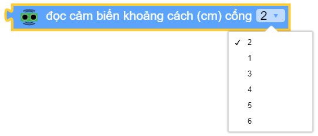
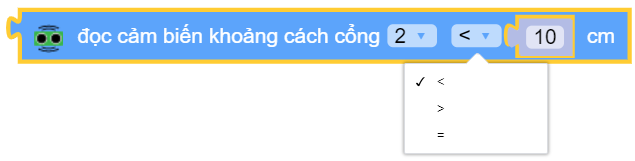

Cảm biến đo khoảng cách
=============================================

Chức năng chính của cảm biến đo khoảng cách

.. function:: ultrasonic.distance_cm(PORT)
----------------------

Trả về giá trị khoảng cách đo được từ mắt đọc của ultrasonic tới vật thể đổi diện với đơn vị ``centimet``
Tham số ``PORT`` có giá trị từ ``1 ~ 6`` tương ứng từ PORT 1 đến PORT 6 của xController.

.. function:: ultrasonic.distance_cm(PORT) < 10
----------------------

Trả về giá trị ``True`` hoặc ``False`` khi so sánh khoảng cách đo được từ cảm biến khoảng cách tới vật thể đổi diện với một giới hạn cho trước (đơn vị ``centimet``)

Ví dụ
----------------------
Hiển thị khoảng cách đo được từ cảm biến siêu âm 

.. image:: images/ultra-3.png
    :width: 500
    :align: center

