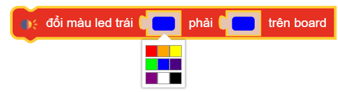
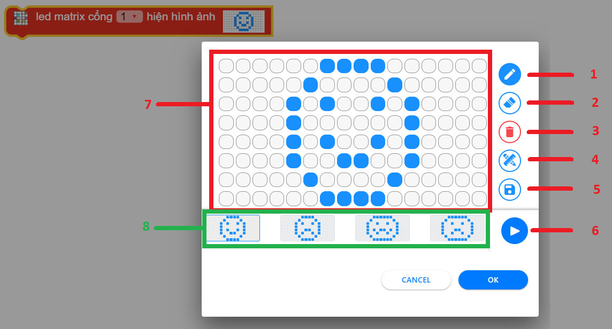
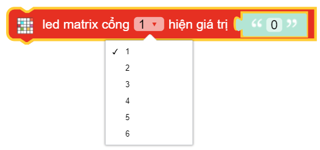

Các khối lệnh "Hiệu ứng"
==========

say(TEXT)
----------------------

In ra cửa sổ thông tin một giá trị ``TEXT`` nào đó

Khi chạy chương trình, nhấn vào menu Chức năng ``Setting`` > chọn ``Hiện thông tin từ xBuild`` để mở cửa sổ hiển thị thông tin.

.. image:: images/show-3.png
    :scale: 100 %
    :align: center

Trên màn hình chính xẽ xuất hiện một chú xBot kèm giá trị bạn muốn in vừa rồi.

speaker.play(BIRTHDAY)
----------------------

Phát một bài hát như được lựa chọn trong danh sách có sẵn.

.. image:: images/speaker-1.png
    :scale: 100 %
    :align: center

speaker.play(BIRTHDAY, wait=True)
----------------------

Phát một bài hát như được lựa chọn trong danh sách có sẵn và chờ đến khi bài hát kết thúc.

.. image:: images/speaker-2.png
    :scale: 100 %
    :align: center

speaker.play(['C3:1'], wait=True)
----------------------

Phát một nốt nhạc với độ dài nhất định theo nhạc lý.

speaker.pitch(frequency, time)
----------------------

.. image:: images/speaker-4.png
    :scale: 100 %
    :align: center

Phát 1 âm thanh với tần số và độ dài truyền vào, trong đó:
    
    - *frequency* : Dữ liệu số, tần số âm thanh được phát và phạm vi giá trị của nó là ``0 ~ 5000``.
    - *time*: Tính theo ``giây``.

speaker.stop()
----------------------

.. image:: images/speaker-5.png
    :scale: 100 %
    :align: center

Dừng chơi nhạc.

led_onboard.show(index, color, time)
----------------------

Hiển thị cả 2 đèn led trên mạch xController với màu sắc như bảng lựa chọn trong khoảng thời gian ``time`` (Tính theo giây).

led_onboard.show(index, color)
----------------------

Hiển thị đèn led trên mạch xController tùy chọn từng màu sắc cho đèn bên trái hoặc đèn bên phải.

led_onboard.show(0, (50, 50, 50))
----------------------

Hiển thị đèn led trên mạch xController tùy chọn từng thông số ``R|G|B`` màu sắc cho đèn bên trái, đèn bên phải, hoặc cả hai.

led_onboard.show(0, (0, 0, 0))
----------------------

Tắt toàn bộ LED.

led_matrix.show(PORT, Image.IMAGE)
----------------------

Hiển thị lên màn hình LED Matrix những hình ảnh có sẵn hoặc vẽ.

Giao diện trình chỉnh sửa hình ảnh hiển thị lên Led Matrix:

Trong đó:

    1: Bút vẽ - Chọn rồi nhấn vào các chấm trắng trên khung vẽ 7. Khi chấm trắng chuyển sang chấm xanh tức là led led tại vị trị trí đó sẽ sáng.

    2: Tẩy - Chọn rồi xóa các chấm xanh trên khung vẽ 7.

    3: Delete - Xóa toàn bộ nội dung trên khung vẽ 7.

    4: Thước đo - Bật hoặc tắt thước đo để dễ dàng xác định vị trí đèn led cần sáng hoặc tắt.

    5: Lưu - Lưu lại nội dung bạn vừa vẽ. Nội dụng đã lưu sẽ xuất hiện trong danh sách 8.

    6: Play/Pause - Chạy thử hoặc dừng hiển thị nội dung trên module để kiểm tra kết quả.

    7: Khung vẽ - Đây là nơi bạn tạo nội dung cho Lex Matrix.

    8: Danh sách nội dung: Nơi đây chứa các nội dung có sẵn, cũng như các nội dung mà bạn đã khởi tạo. Rê chuột hoặc kéo qua trái phải để xem thêm nội dung.

led_matrix.show(PORT, TEXT)
----------------------

Hiển thị lên màn hình LED Matrix những văn bản bất kì, trong đó *TEXT* là văn bản bạn muốn hiển thị. ``TEXT`` ghi không có dấu.

Các ví dụ
----------------------

**Ví dụ 1:** Phát bài Happy Birthday khi nhấn giữ nút trên xController

**Ví dụ 2:** Bật tắt hai LED Onboard

**Ví dụ 3:** Hiển thị hình trái tim và chữ OHSTEM lên màn hình LED Matrix

