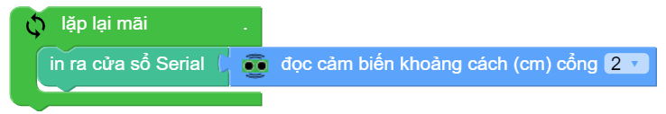
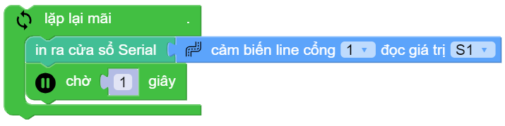
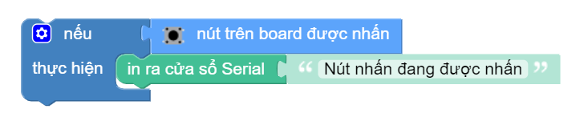

Các khối lệnh "Đầu vào"
==========

ultrasonic.distance_cm(PORT)
----------------------

Trả về giá trị khoảng cách đo được từ mắt đọc của ultrasonic tới vật thể đổi diện với đơn vị ``centimet``
Tham số ``PORT`` có giá trị từ ``1 ~ 6`` tương ứng từ PORT 1 đến PORT 6 của xController.

ultrasonic.distance_cm(PORT) < 10
----------------------

.. image:: images/ultra-2.png
    :scale: 100 %
    :align: center

Trả về giá trị ``True`` hoặc ``False`` khi so sánh khoảng cách đo được từ cảm biến khoảng cách tới vật thể đổi diện với một giới hạn cho trước (đơn vị ``centimet``)

line_array.read(PORT)
----------------------

.. image:: images/line-array-1.png
    :scale: 100 %
    :align: center

Đọc trạng thái của cảm biến dò vạch.
Trong đó:

    - *PORT* : Có giá trị từ ``1 ~ 6`` tương ứng từ PORT 1 đến PORT 6 của xController.
    - Kết quả trả về ``TUPLE`` 4 giá trị tương ứng với trạng thái của 4 mắt S1 đến S4, ví dụ: ``(0, 1, 1, 0)`` với ``0`` là đọc được line trắng còn ``1`` là line đen.

line_array.read(PORT, TUPLE)
----------------------

Đọc trạng thái từng mắt đọc của cảm biến dò vạch.
Trong đó:
    
    - *PORT* : Có giá trị từ ``1 ~ 6``tương ứng từ PORT 1 đến PORT 6 của xController.
    - *TUPLE* : Có giá trị từ ``S1 ~ S4`` tương ứng với 4 mắt đọc của Module.

btn_onboard.is_pressed()
----------------------

Lấy giá trị hiện tại của nút nhấn trên board.

Kết quả trả về là ``True`` khi nút được nhấn, hoặc là ``False`` khi nút không được nhấn.

motion.get_accel(x|y|z)
----------------------

.. image:: images/motion-1.png
    :scale: 100 %
    :align: center

Trả về giá trị góc nghiêng của xController và cho ta biết xController đang nghiêng về hướng nào.
Tầm giá trị lý thuyết: ``-16384 ~ 16384``

    - *x* : nghiêng về sau hay trước.
    - *y* : nghiêng sang trái hay phải.
    - *z* : xController đang úp hay ngửa.

motion.get_gyro_roll|pitch|yaw()
----------------------

Trả về giá trị ``roll|pitch|yaw`` của cảm biến gyroscope.
Tầm giá trị lý thuyết: ``-16 ~ 16``

motion.is_shaked()
----------------------

.. image:: images/motion-3.png
    :scale: 100 %
    :align: center

Trả về giá trị ``TRUE`` khi xController bị lắc.

Các ví dụ
----------------------

**Ví dụ 1:** Hiển thị khoảng cách đo được từ cảm biến siêu âm 

**Ví dụ 2:** Test module bám line đen

**Ví dụ 3:** Test trạng thái mắt đọc số 1

**Ví dụ 4:** Xác định trạng thái nút nhấn

**Ví dụ 5:** Xác định xController nghiêng qua trái hay phải

