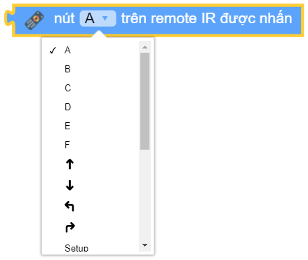
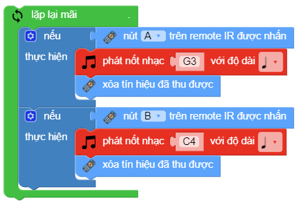

ir_rx.get_code()
==========

Trả về chuỗi tương ứng với phím được nhấn trên IR remote.

Trên remote có các nút nhấn là A|B|C|D|E|F|lên|xuống|trái|phải|setup|0|1|2|3|4|5|6|7|8|9, tương ứng với các giá trị đã được khai báo sẵn trong thư viện như sau: IR_REMOTE_A, IR_REMOTE_B ... IR_REMOTE_F .. IR_REMOTE_0 .. IR_REMOTE_9, IR_REMOTE_SETUP

Ví dụ
----------------------

Thay đổi mày sắc đèn led trên bo mạch bằng cách nhấn phím A hoặc B trên remote.

Khối lệnh này và khối lệnh xóa tín hiệu thu được để tránh trùng lặp tín hiệu

