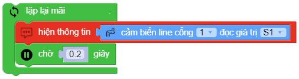

line_array.read(PORT, TUPLE)
==========

.. image:: images/line-array-2.png
    :scale: 100 %
    :align: center

Đọc trạng thái từng mắt đọc của cảm biến dò vạch.
Trong đó:
    
    - *PORT* : Có giá trị từ ``1 ~ 6``tương ứng từ PORT 1 đến PORT 6 của xController.
    - *TUPLE* : Có giá trị từ ``S1 ~ S4`` tương ứng với 4 mắt đọc của Module.

Ví dụ
----------------------

