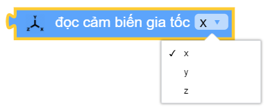
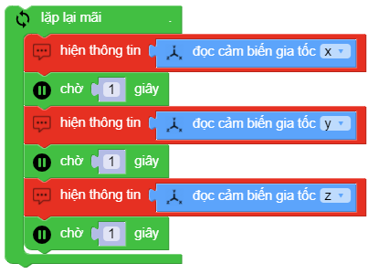

motion.get_accel(x|y|z)
==========

Trả về giá trị góc nghiêng của xController và cho ta biết xController đang nghiêng về hướng nào.
Tầm giá trị lý thuyết: ``-16384 ~ 16384``

    - *x* : nghiêng về sau hay trước.
    - *y* : nghiêng sang trái hay phải.
    - *z* : xController đang úp hay ngửa.

Ví dụ
----------------------

