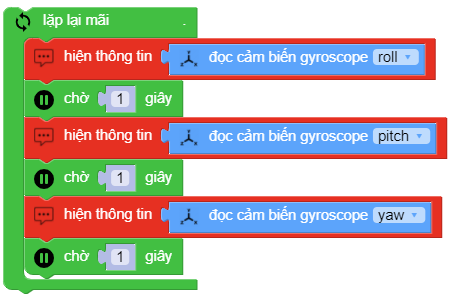

motion.get_gyro_roll|pitch|yaw()
==========

.. image:: images/motion-2.png
    :scale: 100 %
    :align: center

Trả về giá trị ``roll|pitch|yaw`` của cảm biến gyroscope.
Tầm giá trị lý thuyết: ``-16 ~ 16``

Ví dụ
----------------------

