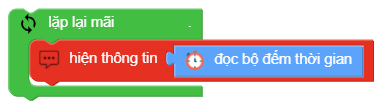

timer.get()
==========

.. image:: images/timer-2.png
    :scale: 100 %
    :align: center

Trả về giá trị tổng thời gian chạy của chương trình kể từ khi bắt đầu (tính theo mili giây)

Ví dụ
----------------------

Hiển thị khoảng cách đo được từ cảm biến siêu âm 

