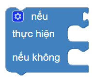

Các khối lệnh "Logic"
==========

If...
----------------------

Nếu như điều kiện đúng thì thực hiện các lệnh.

.. image:: images/logic-1.png
    :scale: 100 %
    :align: center

Bạn có thể thêm nhiều điều kiện và đầu ra tương ứng bằng cách nhấn vào ""Cài đặt""

.. image:: images/logic-1-1.png
    :scale: 100 %
    :align: center

If...Else...
----------------------

Nếu như điều kiện đúng thì thực hiện các lệnh đầu. Nếu điều kiện sai thì thực hiện các lệnh sau.

So sánh các điều kiện
----------------------

Trả về kết quả đúng nếu 2 điều kiện thỏa mãn phương thức so sánh: bằng, khác, nhỏ hơn, nhỏ hơn hoặc bằng, lớn hơn, lớn hơn hoặc bằng.

Nếu như điều kiện đúng thì thực hiện các lệnh đầu. Nếu điều kiện sai thì thực hiện các lệnh sau.

.. image:: images/logic-3.png
    :scale: 100 %
    :align: center

Toán tử AND và toán tử OR
----------------------

``và`` Trả về giá trị ``True`` nếu cả hai đầu vào đều đúng.

``hoặc`` Trả về giá trị ``True`` nếu ít nhất một trong hai đầu vào đúng.

.. image:: images/logic-4.png
    :scale: 100 %
    :align: center

Not True
----------------------

Hoàn trả Đúng (``True``) nếu đầu vào Sai. Hoàn trả Sai (``False``) nếu đầu vào Đúng.

.. image:: images/logic-5.png
    :scale: 100 %
    :align: center

True và False
----------------------

Hoàn trả về giá trị ``Đúng`` hoặc ``Sai``.

.. image:: images/logic-6.png
    :scale: 100 %
    :align: center

Các ví dụ:
----------------------

**Ví dụ 1:** Sử dụng khối ""nếu...không...""

.. image:: images/logic-7.png
    :scale: 100 %
    :align: center

**Ví dụ 2:** Sử dụng khối so sánh

.. image:: images/logic-8.png
    :scale: 100 %
    :align: center