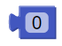

Các khối lệnh "Tính toán"
==========

Số
----------------------

Phép toán cơ bản
----------------------

Trả về kết quả của các phép toán cộng, trừ, nhân, chia, bình phương

.. image:: images/math-2.png
    :scale: 100 %
    :align: center

Random (Ngẫu nhiên)
----------------------

Hoàn trả một số nguyên bất kì lớn hơn hoặc bằng số đầu và nhỏ hơn hoặc bằng số sau

.. image:: images/math-3.png
    :scale: 100 %
    :align: center

Hoàn trả một phân số bất kì không nhỏ hơn 0 và không lớn hơn 1

Phép toán nâng cao
----------------------

Hoàn trả về kết quả của phép toán:

    Căn bậc hai của số đầu vào

    Giá trị tuyệt đối của số đầu vào

    Đổi dấu (âm sang dương và ngược lại) của số đầu vào

    Logarit của số đầu vào

    Logarit cơ số 10 của số đầu vào

    Lũy thừa cơ số e với số mũ đầu vào
    
    Lũy thừa cơ số 10 với số mũ đầu vào

.. image:: images/math-5.png
    :scale: 100 %
    :align: center

Hoàn trả về kết quả của phép toán sin, cos, tan, asin, acos, atan của một góc (theo độ) là đầu vào

Kiểm tra loại số
----------------------

Kiểm tra con số xem nó có phải là số chẵn, số lẻ, nguyên tố, nguyên, dương. âm, hay xem nó có chia hết cho số dư đầu vào vào hay không. Hoàn trả đúng (``True``) hay sai (``False``)

.. image:: images/math-7.png
    :scale: 100 %
    :align: center

Làm tròn
----------------------

Làm tròn lên hoặc làm tròn xuống đầu vào.

Lấy số dư
----------------------

Kết quả trả về là số dư khi chia số thứ nhất cho số thứ 2

Quy đổi
----------------------

Đổi một số trong một khoảng này sang một khoảng khác

.. image:: images/math-10.png
    :scale: 100 %
    :align: center

Ví dụ
----------------------

In ra màn hình các phép toán

