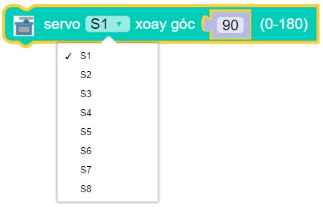
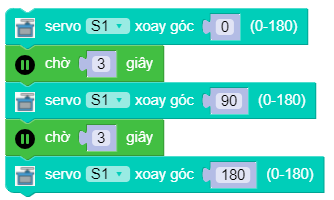

servo.position(index, degree)
==========

Điều khiển động cơ servo 180 độ quay tới một góc nào đó tức thời. Trong đó:

    - *index* là tham số có giá trị ``0 ~ 7`` tương ứng với 8 cổng gắn servo trên board xController.
    - *degree* là tham số góc quay của servo có giá trị ``0 ~ 180`` độ.

Ví dụ
----------------------

