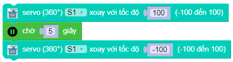

servo.spin(index, speed)
==========

Điều khiển động cơ servo 360 độ quay với tốc độ ``speed``. Trong đó:

    - *index* là tham số có giá trị ``0 ~ 7`` tương ứng với 8 cổng gắn servo trên board xController.
    - *speed* là tốc độ quay của servo 360 độ với phạm vi tham số là ``-100 ~ 100``. Số âm và số dương biểu thị chiều quay của động cơ.

Ví dụ
----------------------

