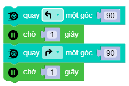

robot.turn_right_angle|turn_left_angle(angle)
==========

.. image:: images/robot-3.png
    :scale: 100 %
    :align: center

Điều khiển xBot di chuyển rẽ qua phải/trái một góc ``angle`` với tốc độ ``speed``, trong đó *angle* là góc cần xoay với phạm vi tham số là ``0 ~ 360``.
        

Ví dụ
----------------------

