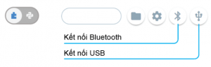

Kết nối
====================

Bước 1: Cài đặt driver trên máy tính
-----------

(Nếu bạn sử dụng kết nối Bluetooth để làm việc với xController thì hãy bỏ qua bước này)

Để cài driver cho máy, bạn tham khảo hướng dẫn chi tiết trên Wiki của xBuild tại đường link  https://ohstem.vn/knowLEDge-base/xbuild/.

Bước 2: Kết nối trên app
-----------

.. image:: images/connect-1.png
    :width: 420
    :align: center

1. Chạy ứng dụng OhStem App hoặc truy cập vào https://app.ohstem.vn, chọn thiết bị là xBuild.

2. Vào menu Lập Trình.

.. image:: images/connect-2.png
    :width: 420
    :align: center

Trong giao diện lập trình, nhấn vào nút kết nối tương ứng với kiểu kết nối bạn muốn sử dụng (Bluetooth hay USB).

Chọn thiết bị để kết nối như hình. Sau khi kết nối thành công, biểu tượng tương ứng sẽ chuyển sang màu xanh dương.