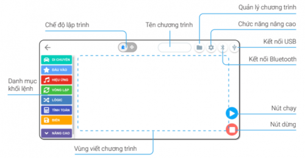
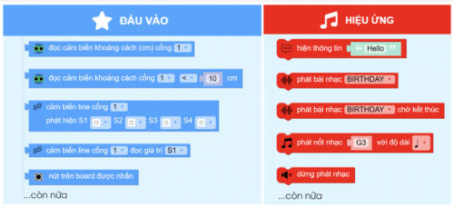
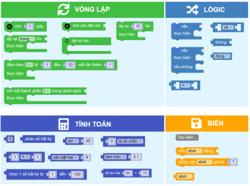
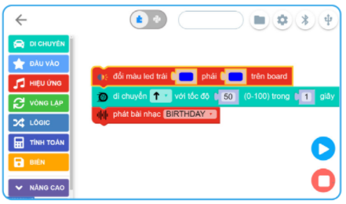
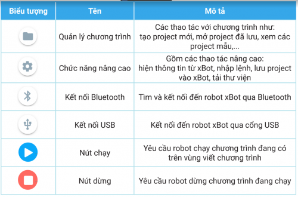

Giao diện
====================

Để mở giao diện lập trình trong phần mềm OhStem App, bạn vào menu Lập trình từ màn hình trang chủ.

Giao diện lập trình của OhStem App:

Chúng ta cùng nhau tìm hiểu từng thành phần có trên giao diện này.

Danh mục khối lệnh
-----------

Đây là khu vực chứa các nhóm khối lệnh, với nhiều màu sắc khác nhau cho từng nhóm, giúp chúng ta dễ dàng tìm được khối lệnh cần sử dụng khi cần.

Mỗi nhóm khối lệnh gồm nhiều các khối lệnh giúp điều khiển robot.

Nhóm Di chuyển
-----------

Gồm các khối lệnh để điều khiển 2 động cơ DC (nối với 2 bánh xe) và 8 động cơ servo (cần gắn thêm) có trên robot.

.. image:: images/frontend-2.png
    :width: 600
    :align: center

Nhóm Đầu vào
-----------

Gồm các khối lệnh để đọc các cảm biến có trên robot như cảm biến khoảng cách, cảm biến dò đường…

Nhóm Hiệu ứng
-----------

Gồm các khối lệnh để điều khiển đèn LED, loa và màn hình LED matrix.

Các nhóm hỗ trợ xây dựng logic của chương trình
-----------

Gồm các khối lệnh để xây dựng logic xử lý của chương trình như vòng lặp, kiểm tra và điều kiện, tính toán… Các khối lệnh này sẽ được hướng dẫn cụ thể ở các bài sau.

Vùng viết chương trình
-----------

Đây là nơi chúng ta lắp ghép các khối lệnh với nhau và tạo thành chương trình. Bạn có thể kéo và di chuyển, phóng to, thu nhỏ các khối lệnh. Phần lớn thời gian chúng ta sẽ làm việc ở vùng này để hoàn thiện chương trình cần xây dựng để điều khiển robot theo ý muốn.

Chế độ lập trình
-----------

OhStem App hỗ trợ 2 chế độ lập trình là: lập trình kéo thả khối lệnh và lập trình bằng text với ngôn ngữ MicroPython. Phần mềm cho phép chuyển đổi 2 chế độ này dễ dàng chỉ bằng 1 cú click.

Các nút chức năng
-----------

Giao diện gồm nhiều nút với các chức năng khác nhau như sau:

*Lưu ý:* Kết nối USB chỉ hỗ trợ trên máy tính và laptop, không hỗ trợ trên mobile app.