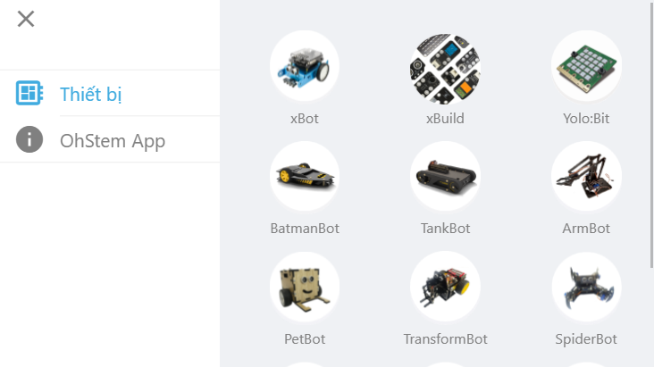
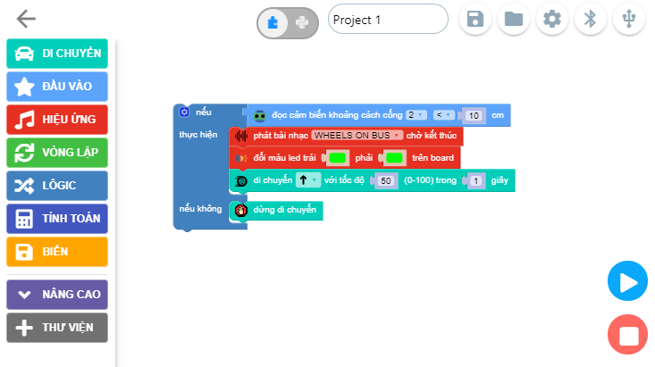

Giới thiệu
====================

OhStem cung cấp phần mềm OhStem App giúp điều khiển và lập trình cho robot. Phần mềm này có thể chạy trên nhiều nền tảng từ mobile đến PC/Laptop và có thể lập trình cho rất nhiều các thiết bị khác nhau do OhStem cung cấp. 

Phần mềm có nhiều tính năng từ điều khiển, hướng dẫn lắp ráp cho đến các bài học và công cụ lập trình cho robot.

.. image:: images/intro-2.png
    :width: 600
    :align: center

Về giao diện của OhStem App, phần mềm này hỗ trợ lập trình bằng giao diện kéo thả các khối lệnh, phù hợp với các bạn nhỏ và người mới học lập trình.

*Giao diện lập trình khối lệnh của OhStem App*

Ngoài, phần mềm OhStem App cũng cho phép tự thiết kế giao diện điều khiển theo ý mình.