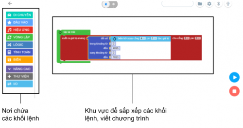
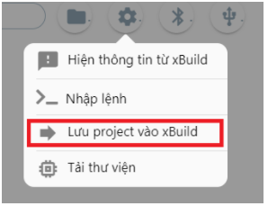

Chạy và lưu project
====================

Bước 1: Viết và chạy chương trình
-----------

1. Chọn khối lệnh lặp lại mãi và kéo vào khu vực bên phải

.. image:: images/runandsave-2.png
    :scale: 100 %
    :align: center

2. Bật đèn LED trên board trong 1 giây bằng khối lệnh đổi màu LED trên board và chờ 1 giây

.. image:: images/runandsave-3.png
    :scale: 100 %
    :align: center

3. Tắt đèn LED trong 1 giây (bằng cách đổi độ sáng bằng 0)

.. image:: images/runandsave-4.png
    :scale: 100 %
    :align: center

4. Đặt tên cho chương trình để lưu chương trình đang viết

.. image:: images/runandsave-5.png
    :scale: 100 %
    :align: center

5. Nhấn nút chạy chương trình

.. image:: images/runandsave-6.png
    :scale: 100 %
    :align: center

Sau khi nhấn nút chạy chương trình, đèn LED RGB trên xController sẽ nhấp nháy sáng tắt liên tục (Sáng đèn trong 1 giây và tắt trong 1 giây).

Bước 2: Lưu chương trình vào xController
-----------

Khi bạn chạy chương trình, chương trình chỉ được chạy một lần và sẽ không tự động chạy khi xController bị Reset. Nếu bạn muốn chương trình luôn được chạy khi xController được cấp nguồn hoặc sau khi khởi động, bạn có thể làm như sau:

Nhấn vào nút Cài đặt nâng cao ().

Chọn Lưu project