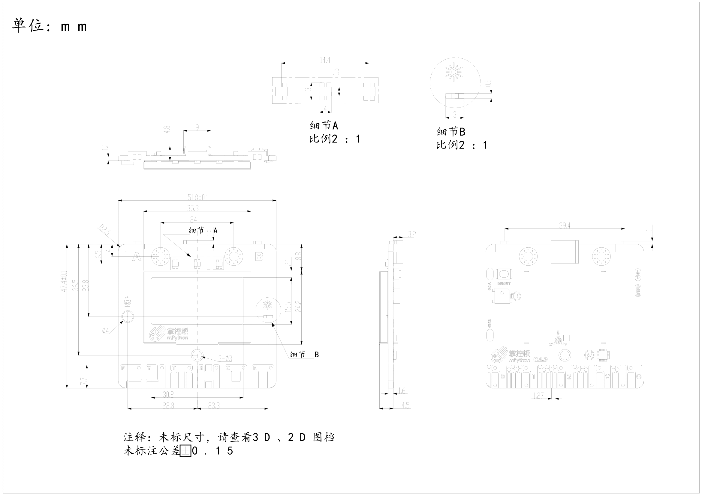

Hardware
====================

xController được thiết kế bởi Ohstem với khả năng lập trình đa nền tảng như Block, Arduino, MicroPython.

.. image:: images/xBuild-2.png
  :width: 600
  :align: center

Thông số kỹ thuật
-----------

xController Board có các tính năng phần cứng sau:

  - Bộ vi điều khiển ESP-32

    - Bộ xử lý ：Bộ vi xử lý lõi kép Tensilica LX6（một để Xử lý Kết nối Tốc độ Cao và một để Phát triển Ứng dụng Độc lập）
    - Tần số chính: tần số đồng hồ lên đến 240mhz
    -	SRAM：520KB
    - Flash：8MB
    - Tiêu chuẩn Wi-Fi：FCC/CE/TELEC/KCC
    - Wi-Fi Alliance：802.11 b/g/n/d/e/i/k/r (802.11n，high speed 150 Mbps)，A-MPDU and A-MSDU packed，support 0.4us protective interval
    - Dải tần số：2.4~2.5 GHz
    - Giao thức BlueTooth ：Tuân theo tiêu chuẩn BlueTooth 4.2 BR / EDR và ​​BLE
    - Truyền phát âm thanh qua Bluetooth ：CVSD và âm thanh SBC công suất thấp ：10uA

  - Chế độ cấp nguồn:
    - Sử dụng cáp micro USB nối với máy tính (dùng khi lập trình) hoặc kết nối với củ sạc điện thoại, sạc dự phòng
    - Sử dụng cặp pin sạc 18650 8.4V cắm vào 1 trong 2 cổng nguồn có trên board
    - Sử dụng nguồn DC adapter 7-12V cắm vào jack tròn trên board 

    Bạn có thể bật tắt nguồn điện bằng công tắc trên bo (chỉ áp dụng với 2 cổng cắm nguồn, nguồn điện từ USB sẽ không bị ảnh hưởng). Khi sử dụng động cơ thì chúng ta cần cấp nguồn bằng pin hoặc DC adapter vì nguồn từ cổng USB là không đủ.

  - Điện áp hoạt động：3.3V
  - Dòng hoạt động tối đa:200mA
  - Dòng tải tối đa::1000mA
  - Phần cứng tích hợp trên xController Board:

    - Bộ điều khiển động cơ DC 2 kênh
    - 8 cổng kết nối cho động cơ servo
    - 6 cổng mở rộng để giao tiếp với các module chức năng
    - 2 đèn LED đa màu RGB
    - Loa (buzzer)
    - LED thu và LED phát hồng ngoại
    - Cảm biến gia tốc và Gyroscope MPU6050

Kích thước và bố cục
--------------

  

Bố cục thành phần / Định nghĩa mã pin
--------------

.. figure:: images/xBuild-3.png
  :width: 600px
  :align: center

.. _mPythonPindesc:

xController Board interface pin configuration
+++++++++++++++++++++++++

=============== ======  ====================================  
 PORT            Type    Mô Tả
 PORT 1          I/O     Digital Input, Analogue/Digital Output
 PORT 2          I/O     Digital Input, Analogue/Digital Output
 PORT 3          I/O     Digital Input, Analogue/Digital Output 
 PORT 4          I/O     Analogue/Digital Input, Analogue/Digital Output 
 PORT 5          I/O     Analogue/Digital Input, Analogue/Digital Output 
 PORT 6          I/O     Analogue/Digital Input, Analogue/Digital Output 
   
=============== ======  ==================================== 

Tải xuống các tài liệu liên quan (Cập nhật sau)
--------------

Schematic Diagram
++++++

* :download:`mPython掌控板V2.0.3原理图 </../datasheet/掌控板-V2.0.3.pdf>`

Data Sheet
++++++++++++++++

* :download:`USB-to-UART Bridge：cp2104 </../datasheet/CP2104-SiliconLaboratories.pdf>`
* :download:`ESP32-WROOM </../datasheet/esp32-wroom-32_datasheet_cn.pdf>`
* :download:`LDO稳压:CE6210 </../datasheet/CE6210.jpg>`
* :download:`加速度计:MSA300 </../datasheet/MSA300-V1.0-ENG.pdf>`
* :download:`地磁传感器:MMC5983MA </../datasheet/MMC5983MA.pdf>`
* :download:`OLED：128x64 </../datasheet/1.30-SPEC QG-2864KSWLG01 VER A.pdf>`

Mechanical Drawing
+++++++++++++++++

* :download:`mPython掌控板v2.0外观规格图 </../datasheet/掌控板V2.0-3D-2D图档-20200102.rar>`
