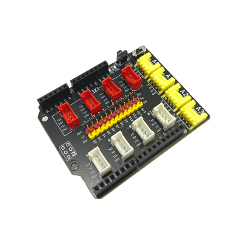
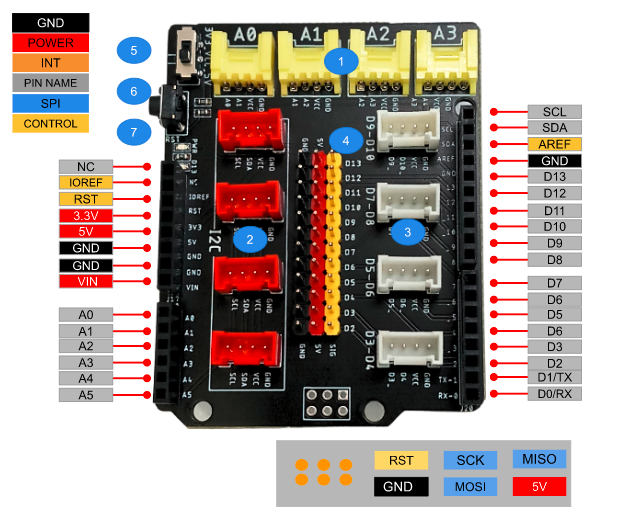
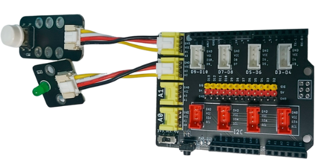

3. Mạch mở rộng cho Arduino UNO
===========

|

Đây là board mạch mở rộng cho Arduino UNO, có tích hợp chân cắm Grove để bạn có thể dễ dàng kết nối mạch Arduino với các thiết bị OhStem hơn, không cần phải dùng đến các dây Jumper lộn xộn, phức tạp.

Mạch mở rộng cho Arduino này có thiết kế thêm một công tắc chuyển đổi nguồn từ 3.3V sang 5V, giúp bạn dễ dàng chọn loại điện áp phù hợp với vi mạch mà bạn muốn sử dụng.

**1. Mua sản phẩm**
-----------
----------

..  image:: images/gio.png
    :alt: some image
    :target: https://ohstem.vn/product/mach-mo-rong-cho-arduino/  
    :class: with-shadow
    :scale: 100%
    :align: center
|

**2. Thông số kỹ thuật**
---------
------------

- **Thông số kỹ thuật**

    + Điện áp hoạt động: 3.3V - 5V
    + Nhiệt độ hoạt động: -25 đến 85 độ C
    + Cổng analog: 4
    + Cổng I2C: 4
    + Cổng Digital: 4
    + Chân cắm động cơ: 11
    + Kích thước: 69mm x 53mmm

 
**3. Phần cứng**
---------
------------   

|

- 1 - Cổng Analog: Bao gồm 4 cổng là A0, A1, A2, A3 
- 2 - Cổng I2C: 4 cổng I2C
- 3 - Cổng Digital: Bao gồm 4 cổng là: D9 - D10, D7 - D8, D5 - D6, D3 - D4
- 4 - Cổng Servo: Bao gồm 11 cổng từ D2 đến D13
- 5 - Công tắc nguồn: Bạn có thể bật công tắc sang vị trí 5V hoặc 3.3V tùy vào mục đích sử dụng. 
- 6 - Nút Reset: Reset mạch mở rộng Arduino UNO
- 7 - PWR LED: Đèn LED màu xanh khi bật nguồn 

**4. Kết nối**
------------
------------

- **Bước 1**: Chuẩn bị các thiết bị như sau: 

.. list-table:: 
   :widths: auto
   :header-rows: 1
     
   * - .. image:: images/arduino_uno4.png
          :width: 200px
          :align: center
     - .. image:: images/arduino_uno1.png
          :width: 200px
          :align: center
     - .. image:: images/led_don.png
          :width: 200px
          :align: center
     - .. image:: images/nhan_don.png
          :width: 200px
          :align: center
   * - Mạch Arduino UNO
     - Mạch mở rộng Arduino UNO
     - Đèn LED đơn (kèm dây Grove)
     - Nút nhấn đơn (kèm dây Grove)
   * - Mua tại các cửa hàng linh kiện điện tử
     - `Mua sản phẩm <https://ohstem.vn/product/mach-mo-rong-cho-arduino/>`_
     - `Mua sản phẩm <https://ohstem.vn/product/den-led-don/>`_
     - `Mua sản phẩm <https://ohstem.vn/product/nut-nhan-don/>`_

- **Bước 2**: Kết nối Grover - Đèn LED đơn với cổng D5
- **Bước 3**: Kết nối Grover - Nút nhấn đơn với cổng D3
- **Bước 4**: Kết nối Mạch Arduino UNO với máy tính thông qua dây cáp USB. 

**5. Hướng dẫn lập trình với Arduino IDE**
--------
------------

**Cài đặt phần mềm Arduino**
    Bạn có thể tải phiên bản Arduino IDE mới nhất, phù hợp với hệ điều hành của máy tính của bạn tại `trang chủ của Arduino <https://www.arduino.cc/en/Main/Software>`_ (Đường dẫn: `https://www.arduino.cc/en/Main/Software <https://www.arduino.cc/en/Main/Software>`_)

    ..  figure:: images/arduino.png
        :scale: 100%
        :align: center 
    |

    Sau khi tải, bạn tiến hành cài đặt và sử dụng các cấu hình mặc định của phần mềm.

- **Bước 1:** Sao chép chương trình vào Arduino IDE và tải lên Seeeduino.

.. code-block:: guess

    const int button = 3;       // connect a button
    const int LED = 5;       // connect a led
    void setup()
    {
        pinMode(button, INPUT); //set button as an INPUT device
        pinMode(LED, OUTPUT);   //set LED as an OUTPUT device
    }
    void loop()
    {
        int btn = digitalRead(button); //read the status of the button
        digitalWrite(LED, btn);
        delay(10);
    }

- **Bước 2:** Nhấn nút, đèn LED sẽ sáng đèn 
