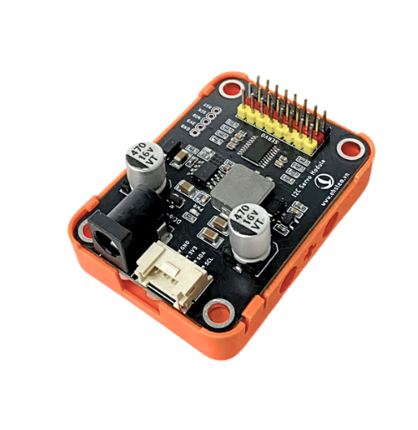
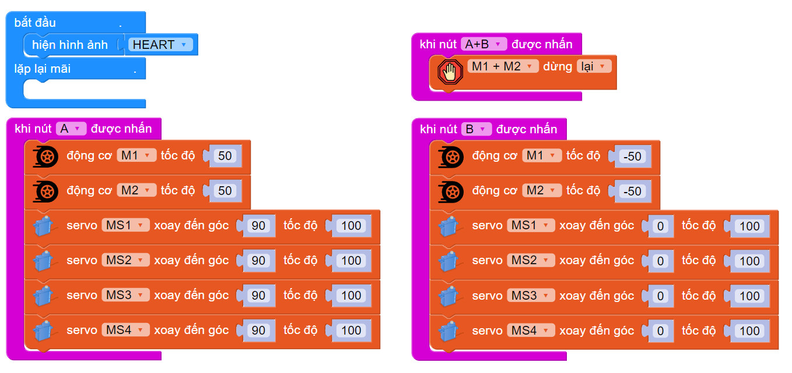
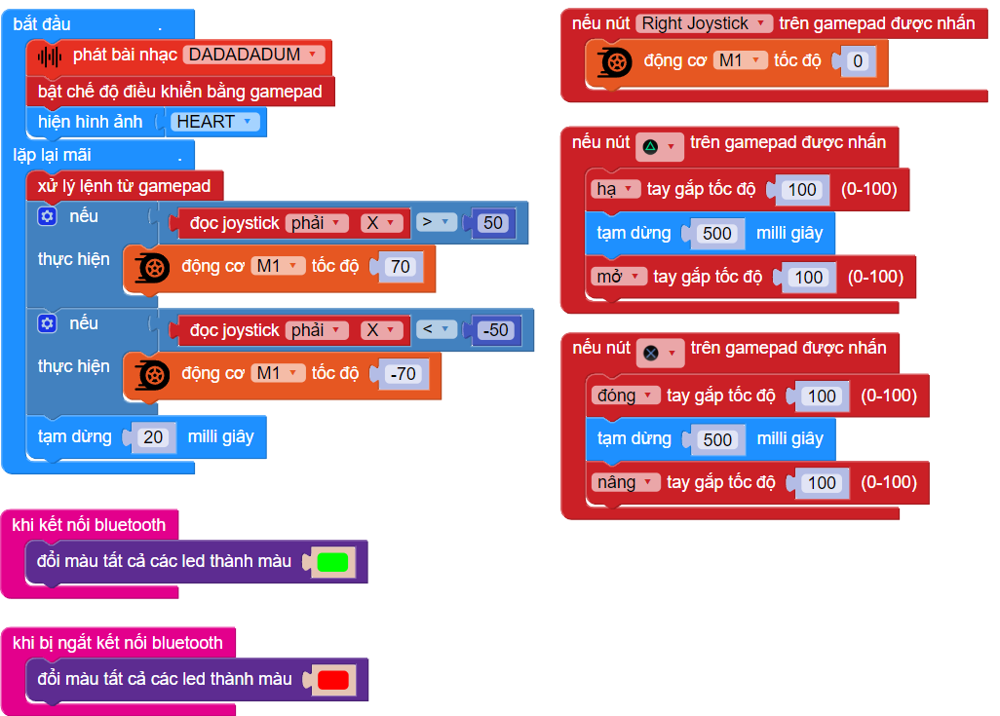

5. Module servo 8 kênh I2C
=========

**1. Giới thiệu**
---------
------------

|

**Module servo 8 kênh I2C** là một module cho phép điều khiển **đồng thời tối đa 8 động cơ servo** thông qua kết nối với các bộ vi điều khiển như Yolo:Bit hoặc Yolo UNO. Mạch sử dụng giao tiếp I2C, giúp tiết kiệm chân kết nối và dễ dàng mở rộng khi xây dựng các dự án có nhiều động cơ servo.

Một vài ứng dụng có thể sử dụng module này như: Hệ thống mở cửa tự động với nhiều cửa, mô hình robot nhiều khớp, cánh tay robot...

**2. Thông số kỹ thuật**
---------
------------

- Hỗ trợ nguồn pin ~9V
- Hỗ trợ điều khiển 8 servo độc lập
- Giao tiếp I2C

 
**3. Kết nối phần cứng**
---------
------------   

- **Chuẩn bị các thiết bị**, bạn có thể chuẩn bị 1 trong 2 mạch lập trình Yolo:Bit hoặc Yolo UNO và các thiết bị như bên dưới: 

.. list-table:: 
   :widths: auto
   :header-rows: 1
     
   * - .. image:: images/yolo_bit.png
          :width: 150px
          :align: center
     - .. image:: images/yolo_uno.png
          :width: 200px
          :align: center
     - .. image:: images/servo_8_kenh.png
          :width: 200px
          :align: center
     - .. image:: images/servo_8_kenh_2.png
          :width: 200px
          :align: center
   * - Máy tính lập trình Yolo:Bit kèm mạch mở rộng
     - Mạch lập trình Yolo UNO
     - Module Module servo 8 kênh I2C
     - Servo
   * - `Mua sản phẩm <https://ohstem.vn/product/may-tinh-lap-trinh-yolobit/>`_
     - `Mua sản phẩm <https://ohstem.vn/product/yolo-uno/>`_
     - Mua sản phẩm
     - `Mua sản phẩm <https://ohstem.vn/product/dong-co-servo-mg90s/>`_

- **Kết nối với Yolo:Bit:** 

..  figure:: images/rfid_2.png
    :scale: 70%
    :align: center 

    *Kết nối vào cổng I2C trên mạch mở rộng Yolo:Bit*

- **Kết nối với Yolo UNO:**

..  figure:: images/rfid_3.png
    :scale: 70%
    :align: center 

    *Kết nối vào cổng I2C trên mạch Yolo UNO*
|
**5. Hướng dẫn lập trình**
--------
------------

1. Tải thư viện **Motion Kit**, bằng cách dán đường link sau vào phần tìm kiếm thư viện: `<https://github.com/AITT-VN/yolobit_extension_motion_kit.git>`_

    Xem hướng dẫn tải thư viện `tại đây <https://docs.ohstem.vn/en/latest/module/thu-vien-yolobit.html>`_

    ..  figure:: images/motion-kit.4.png
        :scale: 80%
        :align: center 
    |

    Thư viện sẽ gồm các câu lệnh điều khiển 2 động cơ và 4 servo:

    ..  figure:: images/motion-kit.5.png
        :scale: 80%
        :align: center 
    |   

2. **Viết chương trình:**

**2.1. Chương trình kiểm tra hoạt động của Motion Kit và các động cơ mở rộng:**

    Với chương trình mẫu sau, bạn có thể dùng nút A và B trên Yolobit module mở rộng Motion Kit:

    Link chương trình: `<https://app.ohstem.vn/#!/share/yolobit/2nAKUw7EB6fGpnf5r7rfvBX4LaR>`_      

.. note:: 
    Khi nhấn nút A, động cơ M1 và M2 sẽ quay với tốc độ 50, đồng thời 4 cổng servo sẽ quay đến vị trí 90. Khi ấn nút B thì động cơ M1, M2 sẽ quay ngược chiều với tốc độ 50 và 4 servo sẽ quay về vị trí 0. Khi ấn nút A+B thì 2 động cơ M1 và M2 sẽ dừng quay.

**2.2. Chương trình kết hợp robot Rover với Motion Kit cùng các động cơ để tạo nên phần cuộn bóng cho robot và được điều khiển từ Gamepad**

    Link chương trình: `<https://app.ohstem.vn/#!/share/yolobit/2n8sxBbVkdPzc1mnY9iua5mtOkw>`_

.. note:: 
    Trong phần lặp mãi mãi, chúng ta sẽ kiểm tra điều kiện joystick phải được kéo theo trục x (phương ngang). Nếu kéo về phía bên phải thì giá trị joystick sẽ là giá trị dương và ngược lại. Khi so sánh với 50 để đảm bảo rằng joystick được kéo theo đúng chiều và không bị ảnh hưởng bởi giá trị nhiễu khi joystick đứng. Lúc này động cơ cổng M1 của Motion kit sẽ hoạt động và tiến hành cuộn - thả theo thiết kế cơ khí. Khi ấn nút joystick phải, động cơ sẽ quay tốc độ 0 (tức là dừng quay).
