**Hướng dẫn cài đặt Arduino và Yolo:Bit**
=============

1. Cài đặt Arduino IDE
-------
-----

Bạn có thể tải phiên bản Arduino IDE mới nhất, phù hợp với hệ điều hành của máy tính của bạn tại `trang chủ của Arduino <https://www.arduino.cc/en/Main/Software>`_ (Đường dẫn: `https://www.arduino.cc/en/Main/Software <https://www.arduino.cc/en/Main/Software>`_)

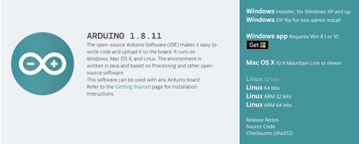
|

Sau khi tải, bạn tiến hành cài đặt và sử dụng các cấu hình mặc định của phần mềm.

2. Cài đặt driver cho Yolo:Bit
--------
-------------

Để máy tính có thể giao tiếp và lập trình được cho Yolo:Bit, bạn cần cài đặt driver trước. Để cài đặt, bạn làm theo các bước sau hoặc xem thêm hướng dẫn tại đường link `ohstem.vn/driver <ohstem.vn/driver>`_.

- **Bước 1**. Tải file cài đặt driver cho chip giao tiếp USB CH340G có trên Yolo:Bit `tại đây <https://drive.google.com/file/d/1zGvzwXecH5fZHGky6Fk18qws-CTowqoU/view?usp=sharing>`_.

- **Bước 2**. Giải nén file đã được download và chạy file **CH341SER.EXE** để tiến hành cài đặt.

- **Bước 3**. Click vào **INSTALL**:

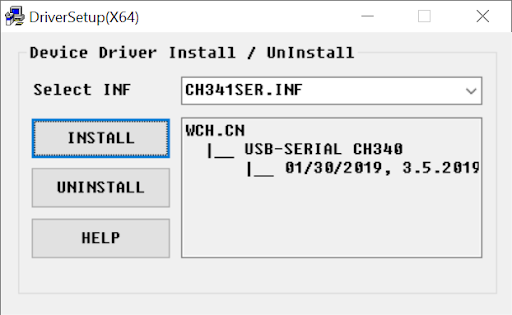
|

- **Bước 4**. Sau khi cài đặt xong, màn hình sẽ hiển thị: **“The drive is successfully Pre-install in advance”** như hình. Lúc này, bạn hãy nhấn vào **“OK”** và tắt app.

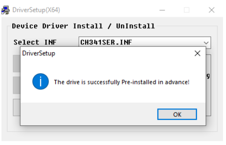
|

- **Bước 5**. Tiếp theo, bạn hãy kết nối Yolo:Bit với máy tính bằng cáp micro USB.

    + **Dành cho người dùng hệ điều hành Windows:** Bạn có thể vào phần **Device Manager**. Trong phần **Ports (COM & LPT)**, bạn sẽ thấy một cổng COM mới mỗi khi kết nối USB với Yolo:Bit. Cổng này sẽ biến mất khi rút cáp USB ra.

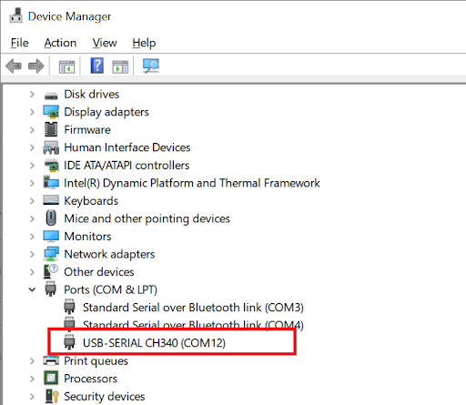
|

    + **Dành cho người dùng hệ điều hành macOS**: Bạn có thể nhấn vào biểu tượng trái táo, chọn mục **About this Mac -> System Report... -> USB**. CH341SER USB Driver sẽ xuất hiện tại đây.

- Nếu driver chưa được cài đặt, hoặc cài đặt chưa thành công, máy tính sẽ hiển thị **“unknown device”** tại mục Device Manager. Trong trường hợp này, bạn cần phải tải về và cài lại driver.

3. Cài đặt board Yolo:Bit trong Arduino IDE
--------
-----------

Phần mềm Arduino có thể lập trình cho rất nhiều loại board mạch khác nhau. Tuy nhiên, bạn cần làm thêm một vài bước sau để có thể làm việc với Yolo:Bit:

1. Mở phần mềm Arduino đã cài đặt.

2. Vào menu **File > Preferences**. Trong tab **Settings**, mục **Additional Boards Manager**, thêm địa chỉ đường dẫn mô tả thông tin Yolo:Bit như hình và nhấn **“OK”** `https://raw.githubusercontent.com/AITT-VN/ohstem_arduino_board/main/package_xcon_index.json <https://raw.githubusercontent.com/AITT-VN/ohstem_arduino_board/main/package_xcon_index.json>`_.

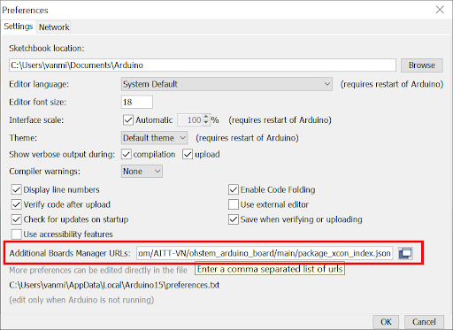
|    

Sau này, để hỗ trợ nhiều loại board khác, bạn có thể nhập nhiều dòng bằng cách nhấn Enter để xuống dòng cho từng link.

3. Mở menu **Tools > Board [tên board đang được chọn] > Boards Manager…**, nhập Ohstem vào thanh search và chọn board OhStem Boards by OhStem Education được tìm thấy như hình dưới, nhấn vào **Install**, chờ đến khi board được cài đặt hoàn tất. Sau khi cài đặt xong, nhấn vào **Close**.

..  figure:: images/arduino.2.png
    :scale: 100%
    :align: center 
|

4. Vào menu **Tools > Board**, chọn loại board là **OhStem Boards > YoloBit** vừa được cài đặt:

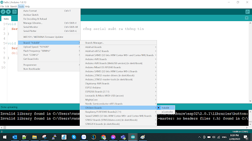
|

5. Vào menu **Tools > Port** để chọn Cổng kết nối đến Yolo:Bit (chính là COM Port hiện ra trong Device Manager chúng ta đã thấy lúc nãy) 

Ví dụ: Trong máy tính Windows của tác giả, cổng trên Device Manager là COM12:

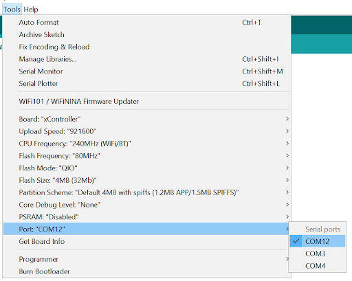
|

Đối với người dùng hệ điều hành macOS, cổng kết nối sẽ được hiển thị là: **/dev/cu.SLAB_USBtoUART**.

4. Chương trình “Hello World”:
--------
-----------

Trong Arduino, bạn hãy tạo một file chương trình mới (**File > New**) và lưu với tên **hello.ino** bằng cách chọn menu **File > Save As…** (chọn thư mục để lưu). Sau đó, bạn copy đoạn code này vào:

.. code-block:: guess

    void setup() {
        Serial.begin(115200); // khởi tạo cổng serial xuất ra thông tin
    }

    void loop() {
        Serial.println("Hello World"); // in ra dòng chữ Hello World
        delay(1000); // tạm dừng chương trình 1 giây
    }

Trên góc trái của Arduino IDE, có 2 nút nhấn với chức năng là: ``Verify`` và ``Upload``. 

    - Nút ``Verify`` dùng để biên dịch chương trình nhưng không nạp (gọi là compile) vào board, chủ yếu để kiểm tra xem chương trình đã viết có bị lỗi không.

    - Nút ``Upload`` dùng để vừa biên dịch vừa nạp chương trình vào board.

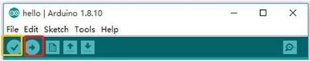
|

Bạn hãy thử nhấn nút ``Upload`` và chờ cho đến khi nạp thành công (Bạn nhớ kết nối Yolo:Bit với máy bằng cáp USB trước khi Upload nhé).

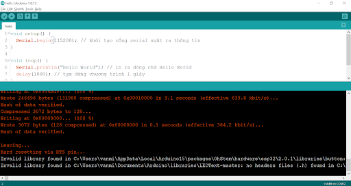
|

Để xem thông tin xuất ra cổng Serial, bạn vào menu **Tools > Serial Monitor**, hoặc click vào nút ``Serial Monitor`` nằm ở góc trên bên phải. 

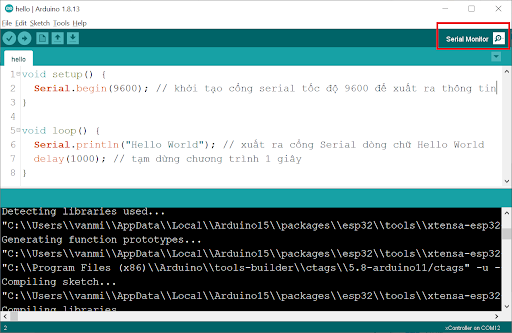
|

Ở cửa sổ **Serial Monitor**, bạn sẽ thấy kết quả chương trình đã thực hiện là: dòng chữ **“Hello World”** được in ra sau mỗi 1 giây:

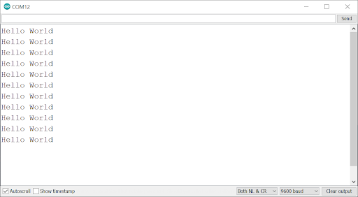
|

Chúc mừng bạn đã hoàn thành chương trình đầu tiên trong chuỗi các bài học. Hãy tiếp tục các bài tiếp theo nhé.

5. Khôi phục firmware Python cho Yolo:Bit
--------------
------------

.. note:: Khi nạp chương trình Arduino, chương trình này sẽ xóa firmware gốc của Yolo:Bit, khiến Yolo:Bit không thể được lập trình bằng Python hay khối lệnh. Để khôi phục lại firmware mặc định của Yolo:Bit, bạn hãy theo hướng dẫn sau:

1. Truy cập vào link `fw.ohstem.vn <https://fw.ohstem.vn/>`_.

2. Chọn **phiên bản firmware mới nhất** của Yolo:Bit, sau đó chọn **cập nhật**. Tại thời điểm viết tài liệu, phiên bản mới nhất là Yolo:Bit - V4 firmware v1.11 (bỏ qua bước cài đặt Driver, nếu máy tính của bạn đã cài đặt trước đó).

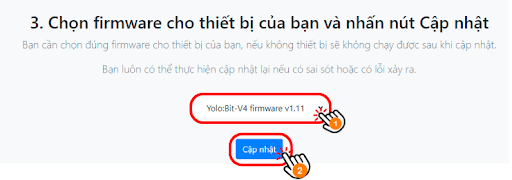

    Chọn **phiên bản firmware mới nhất** của Yolo:Bit

|
