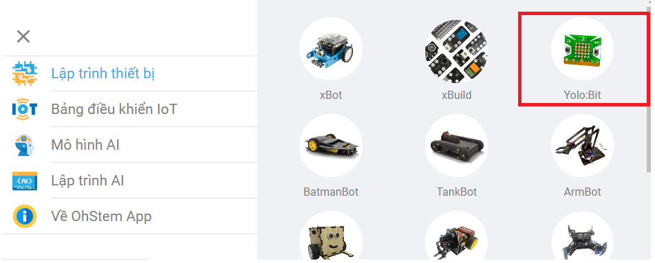
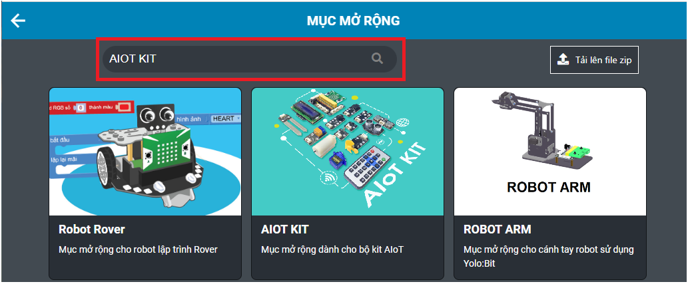
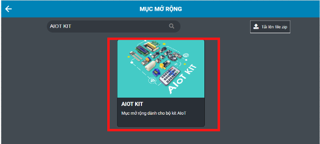
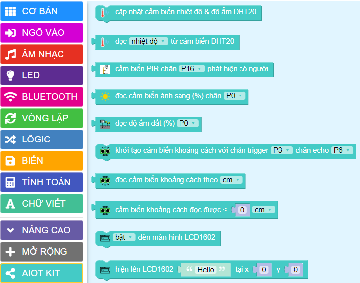

**Hướng dẫn cài đặt thư viện**
===============

Với mỗi thiết bị mở rộng, OhStem sẽ có những thư viện đi kèm trên OhStem App.

Để tải các thư viện bạn sẽ thực hiện theo các bước sau: 

- **Bước 1**: Truy cập vào `<https://app.ohstem.vn/>`_ , chọn thiết bị lập trình Yolo:Bit.

|

- **Bước 2**: Chọn vào mục lập trình. 

|

- **Bước 3**: Trong danh mục khối lệnh, vào mục **MỞ RỘNG** >> Trên thanh tìm kiếm gõ vào **Thư viện mà bạn muốn tìm** >>  nhấn vào biểu tượng kính lúp để tìm: 

    Ví dụ: Tìm thư viện AIOT KIT cho Yolo:Bit, bạn gõ như hình sau:

|

- **Bước 4**: Nhấn vào hình đại diện AIOT KIT để tải thư viện >> nhấn OK

|

    Sau khi tải thành công thư viện, trong danh mục khối lệnh sẽ xuất hiện các khối lệnh như sau: 

|
