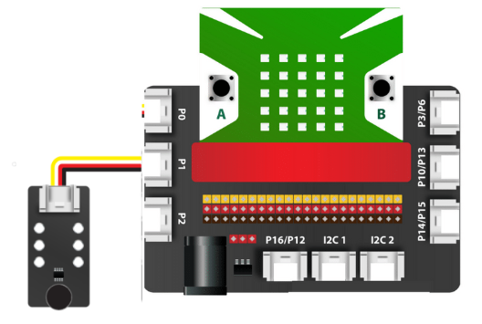

14. Cảm biến âm thanh
============

.. image:: images/15.1.png
    :width: 400px
    :align: center 
| 

Dựa trên micrô, cảm biến âm thanh có thể được sử dụng để phát hiện cường độ âm thanh xung quanh. Thành phần chính của module này là bộ khuếch đại công suất thấp LM358. Cảm biến này có thể được sử dụng để xây dựng một số dự án tương tác như: công tắc điều khiển bằng giọng nói, rô bốt nhảy theo,…

**1. Mua sản phẩm**
-----------
----------

..  image:: images/gio.png
    :alt: some image
    :target: https://ohstem.vn/product/cam-bien-am-thanh/
    :class: with-shadow
    :scale: 100%
    :align: center
|

**2. Thông số kỹ thuật**
---------
------------

- **Thông số kỹ thuật**

    + Điện áp hoạt động: 3.3V
    + Độ nhạy microphone (1 Khz): 50-54dB
    + Nội trở microphone: 2.2 KΩ
    + Tần số của microphone : 16-20 KHz
    + Dạng tín hiệu: ngõ ra analog
    + Dòng điện tối đa: 0.5mA
    + IC khuếch đại công suất: LM358
    + Kích thước module: 48mm x 24mm x 18mm (DxRxC)

- **Pinout của cảm biến**

Cảm biến âm thanh có 4 chân, và mỗi chân có chức năng như sau:

..  csv-table:: 
    :header: "STT", "Chân", "Chức năng"
    :widths: 10, 15, 30

    1, "GND", "Nối đất"
    2, "VCC", "Cấp nguồn (3.3V)"
    3, "NC", "Không sử dụng"
    4, "SIG", "Tín hiệu ngõ ra của cảm biến"

**3. Kết nối**
------------
------------

- **Bước 1**: Chuẩn bị các thiết bị như sau: 

.. list-table:: 
   :widths: auto
   :header-rows: 1
     
   * - .. image:: images/yolo.png
          :width: 200px
          :align: center
     - .. image:: images/mmr.png
          :width: 200px
          :align: center
     - .. image:: images/15.1.png
          :width: 200px
          :align: center
   * - Máy tính lập trình Yolo:Bit
     - Mạch mở rộng cho Yolo:Bit
     - Cảm biến âm thanh (kèm dây Grove)
   * - `Mua sản phẩm <https://ohstem.vn/product/may-tinh-lap-trinh-yolobit/>`_
     - `Mua sản phẩm <https://ohstem.vn/product/grove-shield/>`_
     - `Mua sản phẩm <https://ohstem.vn/product/cam-bien-am-thanh/>`_

- **Bước 2**: Cắm Yolo:Bit vào mạch mở rộng
- **Bước 3**: Sử dụng dây Grove cắm vào cảm biến
- **Bước 4**: Kết nối cảm biến với **P0 trên mạch mở rộng**.

    Bạn có thể kết nối cảm biến âm thanh với chân P0, P1 hoặc P2 trên mạch mở rộng, vì giá trị trả về của cảm biến có giá trị là analog. 
    

**4. Hướng dẫn lập trình**
--------
------------

- **Bước 1:**  Để làm việc với cảm biến âm thanh, bạn cần tải thư viện City:Bit, xem hướng dẫn tải thư viện `tại đây <https://docs.ohstem.vn/en/latest/module/cai-dat-thu-vien.html>`_.

    .. image:: images/city.png
        :width: 250px
        :align: center 
    |

    Sau khi tải thư viện, trong danh mục khối lệnh sẽ xuất hiện các khối lệnh tương ứng:

    .. image:: images/lenh_city.png
        :width: 800px
        :align: center 
    |

- **Bước 2**: Gửi chương trình sau xuống Yolo:Bit

    ..  image:: images/15.3.png
        :scale: 100%
        :align: center 
    |

.. note::

    **Giải thích chương trình:** 

    Chương trình sẽ hiển thị tiếng ồn xung quanh bạn lên cửa sổ Serial, nếu mức độ âm thanh trên 20%, sẽ có âm thanh cảnh báo được phát ra. 

    Hãy thử thay đổi mức độ cảnh báo âm thanh và “vỗ tay” để chương trình của bạn thú vị hơn nhé! 
