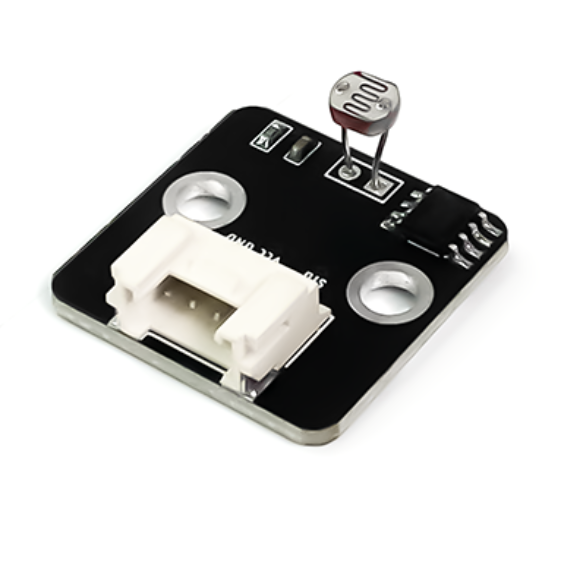
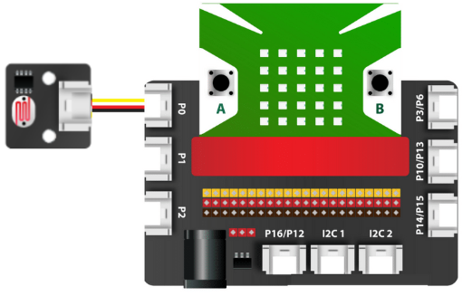
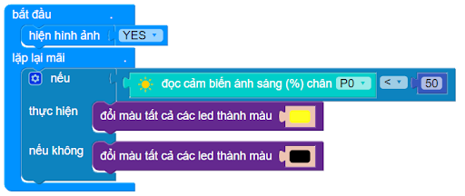

16. Cảm biến ánh sáng
===============

| 

- Cảm biến ánh sáng là thiết bị giúp nhận biết và phát hiện cường độ ánh sáng của môi trường xung quanh. Cảm biến này thích hợp để làm các ứng dụng cơ bản về nhận biết ánh sáng, biết được trời sáng hay trời tối và nhiều ứng dụng thú vị khác.

**1. Mua sản phẩm**
-----------
----------

..  image:: images/gio.png
    :alt: some image
    :target: https://ohstem.vn/product/cam-bien-anh-sang/ 
    :class: with-shadow
    :scale: 100%
    :align: center
|

**2. Thông số kỹ thuật**
---------
------------

- **Thông số kỹ thuật**

    + Điện áp hoạt động: 3.3V
    + Dòng cung cấp: 0.5-3mA
    + Điện trở quang: GL5528
    + Điện trở khi có ánh sáng: 20KΩ
    + Điện trở khi không có ánh sáng: 1MΩ
    + Thời gian phản hồi: 20-30 secs
    + Bước sóng tối đa: 540 nm

- **Pinout của cảm biến**

Cảm biến ánh sáng có 4 chân, và mỗi chân có chức năng như sau:

..  csv-table:: 
    :header: "STT", "Chân", "Chức năng"
    :widths: 10, 15, 30

    1, "GND", "Nối đất"
    2, "VCC", "Cấp nguồn (3.3V)"
    3, "NC", "Không sử dụng"
    4, "SIG", "Tín hiệu ngõ ra của cảm biến"

**3. Kết nối**
------------
------------

- **Bước 1**: Chuẩn bị các thiết bị như sau: 

.. list-table:: 
   :widths: auto
   :header-rows: 1
     
   * - .. image:: images/yolo.png
          :width: 200px
          :align: center
     - .. image:: images/mmr.png
          :width: 200px
          :align: center
     - .. image:: images/17.1.png
          :width: 200px
          :align: center
   * - Máy tính lập trình Yolo:Bit
     - Mạch mở rộng cho Yolo:Bit
     - Cảm biến ánh sáng (kèm dây Grove)
   * - `Mua sản phẩm <https://ohstem.vn/product/may-tinh-lap-trinh-yolobit/>`_
     - `Mua sản phẩm <https://ohstem.vn/product/grove-shield/>`_
     - `Mua sản phẩm <https://ohstem.vn/product/cam-bien-anh-sang/>`_

- **Bước 2**: Cắm Yolo:Bit vào mạch mở rộng
- **Bước 3**: Sử dụng dây Grove cắm vào cảm biến
- **Bước 4**: Kết nối cảm biến với **P0 trên mạch mở rộng**.

    Đây cũng là một cảm biến có giá trị trả về là analog, do đó bạn có thể kết nối với các chân P0, P1, P2 trên mạch mở rộng

**4. Hướng dẫn lập trình với OhStem App**
--------
------------

- **Bước 1:** Tải thư viện **AIOT KIT**, xem hướng dẫn tải thư viện `tại đây <https://docs.ohstem.vn/en/latest/module/cai-dat-thu-vien.html>`_

    .. image:: images/aiot.png
        :width: 250px
        :align: center 
    |

    Sau khi tải thư viện, trong danh mục khối lệnh sẽ xuất hiện các khối lệnh tương ứng:

    .. image:: images/lenh_aiot.png
        :width: 800px
        :align: center 
    |

- **Bước 2**: Gửi chương trình sau xuống Yolo:Bit

|

.. note::

    **Giải thích chương trình:** 
   
    Ở trong vòng lặp lại mãi, chúng ta sẽ khai báo một hàm điều kiện:
    
    - Nếu giá trị đọc được thấp hơn 50 (trời tối), sẽ đổi màu đèn led trên Yolo:Bit thành màu vàng
    - Ngược lại, khi trời sáng, đổi tất cả màu đèn thành màu đen (nghĩa là đèn LED sẽ tắt) 
    
    Chương trình trên sẽ được lặp đi lặp lại liên tục.

**5. Hướng dẫn lập trình Arduino**
--------
------------

- Mở phần mềm Arduino IDE. Xem hướng dẫn lập trình với Arduino `tại đây <https://docs.ohstem.vn/en/latest/module/cai-dat-arduino.html>`_. 

- Copy đoạn code sau, click vào nút ``Verify`` để kiểm tra lỗi chương trình. Sau khi biên dịch không báo lỗi, bạn có thể nạp đoạn code vào board. 

.. code-block:: guess

    #include "YoloBit.h"

    YoloBit yolobit;

    int sensorPin = P0_ADC;
    int sensorValue = 0;

    void setup() {
      Serial.begin(115200);
    }

    void loop() {
      // đọc giá trị cảm biến
      sensorValue = analogRead(sensorPin);
      Serial.println(sensorValue);
      delay(200);
    }
    
.. note:: 
    
    **Giải thích chương trình:** Sau khi nạp chương trình và mở cửa sổ Serial, bạn sẽ thấy giá trị đọc được từ cảm biến được in ra. Bạn hãy thử lấy tay che cảm biến để thấy được sự thay đổi.
