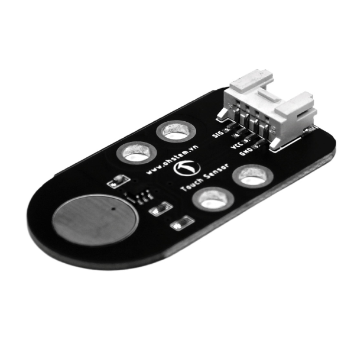

20. Cảm biến chạm
===============

| 

- Hiện nay smartphone đã khá thân thuộc với mọi người. Cảm biến chạm cũng sử dụng cùng cơ chế với những chiếc điện thoại cảm ứng, giúp chúng ta có thể thao tác chỉ với việc chạm tay. Cảm biến chạm có thể được ứng dụng trong các chương trình như chạm tay để bật/tắt đèn, chạm tay để khởi động xe,…

**1. Mua sản phẩm**
-----------
----------

..  image:: images/gio.png
    :alt: some image
    :target: https://ohstem.vn/product/cam-bien-cham/
    :class: with-shadow
    :scale: 100%
    :align: center
|

**2. Thông số kỹ thuật**
---------
------------

- **Thông số kỹ thuật**

    + Khi chạm tay, module phát ra một tín hiệu mức thấp (LOW), khi chạm lại lần nữa sẽ tạo ra mức cao (HIGH)
    + Điện áp: 3.3V
    + Dòng định mức : 5mA
    + Ngõ ra: Digital
    + Kích thước của mạch: 24mm x 48mm x 16mm

- **Pinout của cảm biến**

Cảm biến lửa có 4 chân, và mỗi chân có chức năng như sau:

..  csv-table:: 
    :header: "STT", "Chân", "Chức năng"
    :widths: 10, 15, 30

    1, "GND", "Nối đất"
    2, "VCC", "Cấp nguồn (3.3V)"
    3, "NC", "Không sử dụng"
    4, "SIG", "Tín hiệu cảm biến"

**3. Kết nối**
------------
------------

- **Bước 1**: Chuẩn bị các thiết bị như sau: 

.. list-table:: 
   :widths: auto
   :header-rows: 1
     
   * - .. image:: images/yolo.png
          :width: 200px
          :align: center
     - .. image:: images/mmr.png
          :width: 200px
          :align: center
     - .. image:: images/20.1.png
          :width: 200px
          :align: center
   * - Máy tính lập trình Yolo:Bit
     - Mạch mở rộng cho Yolo:Bit
     - Cảm biến chạm (kèm dây Grove)
   * - `Mua sản phẩm <https://ohstem.vn/product/may-tinh-lap-trinh-yolobit/>`_
     - `Mua sản phẩm <https://ohstem.vn/product/grove-shield/>`_
     - `Mua sản phẩm <https://ohstem.vn/product/cam-bien-cham/>`_

- **Bước 2**: Cắm Yolo:Bit vào mạch mở rộng
- **Bước 3**: Sử dụng dây Grove cắm vào cảm biến
- **Bước 4**: Kết nối cảm biến với **P16/P12 trên mạch mở rộng**.

    Cảm biến chạm có kết quả trả về là digital, trên mạch mở rộng các bạn có thể sử dụng các khe cắm có 2 tín hiệu

**4. Hướng dẫn lập trình**
--------
------------

- Hãy gửi chương trình sau đến Yolo:Bit của bạn: 

|

.. note::

    **Giải thích chương trình:** Nếu cảm biến được chạm vào, tức là trạng thái của chân P16 đang bật. Đèn LED sẽ chuyển sang màu trắng. Nếu không được chạm vào, đèn sẽ tắt. 

    Sử dụng các khối lệnh trong danh mục **CHÂN CẮM**. 
