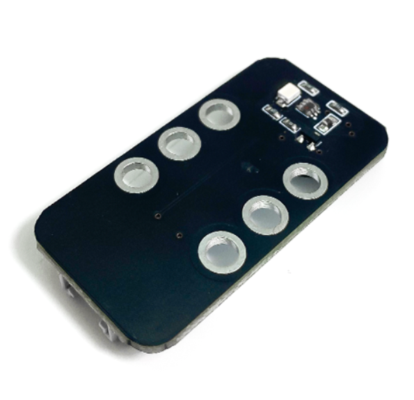
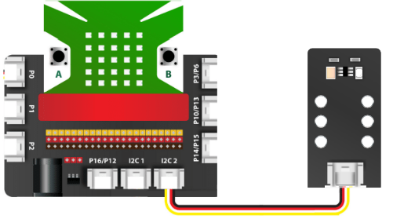
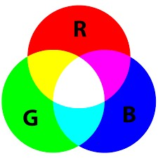
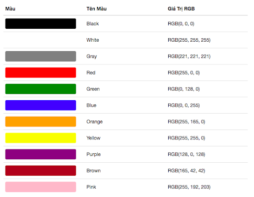

12. Cảm biến màu sắc
=============

| 

Module cảm biến màu sắc là một cảm biến màu có khả năng nhận dạng các loại màu sắc. Module này sử dụng giao thức I2C để giao tiếp.

**1. Mua sản phẩm**
-----------
----------

..  image:: images/gio.png
    :alt: some image
    :target: https://ohstem.vn/product/cam-bien-mau-sac/
    :class: with-shadow
    :scale: 100%
    :align: center
|

**2. Thông số kỹ thuật**
---------
------------

- **Thông số kỹ thuật**

    + Điện áp hoạt động: 3.3V
    + Dòng hoạt động: <5mA
    + Nhiệt độ hoạt động: -20 ~ 60˚C
    + Loại tín hiệu: I2C
    + Kích thước module: 48mm x 24mm x 18mm (DxRxC)

- **Pinout của cảm biến màu sắc**

Cảm biến màu sắc có 4 chân, và mỗi chân có chức năng như sau:

..  csv-table:: 
    :header: "STT", "Chân", "Chức năng"
    :widths: 10, 15, 30

    1, "GND", "Nối đất"
    2, "VCC", "Cấp nguồn (3.3V)"
    3, "SDA", "Truyền tín hiệu"
    4, "SCL", "Xung tín hiệu"

**3. Kết nối**
------------
------------

- **Bước 1**: Chuẩn bị các thiết bị như sau: 

.. list-table:: 
   :widths: auto
   :header-rows: 1
     
   * - .. image:: images/yolo.png
          :width: 200px
          :align: center
     - .. image:: images/mmr.png
          :width: 200px
          :align: center
     - .. image:: images/13.1.png
          :width: 200px
          :align: center
   * - Máy tính lập trình Yolo:Bit
     - Mạch mở rộng cho Yolo:Bit
     - Cảm biến màu sắc (kèm dây Grove)
   * - `Mua sản phẩm <https://ohstem.vn/product/may-tinh-lap-trinh-yolobit/>`_
     - `Mua sản phẩm <https://ohstem.vn/product/grove-shield/>`_
     - `Mua sản phẩm <https://ohstem.vn/product/cam-bien-mau-sac/>`_

- **Bước 2**: Cắm Yolo:Bit vào mạch mở rộng
- **Bước 3**: Sử dụng dây Grove cắm vào cảm biến
- **Bước 4**: Kết nối cảm biến với **cổng I2C trên mạch mở rộng**.

    Bạn có thể kết nối vào 1 trong 2 chân I2C

**4. Hướng dẫn lập trình:**
---------
-------------

- **Bước 1**: Để làm việc với cảm biến, bạn cần tải thư viện **Cảm biến màu sắc**, xem hướng dẫn tải thư viện `tại đây <https://docs.ohstem.vn/en/latest/module/cai-dat-thu-vien.html>`_.

    .. image:: images/13.3.png
        :scale: 100%
        :align: center 
    |

    Sau khi tải thư viện, trong danh mục khối lệnh sẽ xuất hiện các khối lệnh tương ứng:

    .. image:: images/13.4.png
        :scale: 100%
        :align: center 
    |

- **Bước 2**: Gửi chương trình sau lên Yolo:Bit: 

    .. image:: images/13.5.png
        :scale: 100%
        :align: center 
    |
    
.. note::

    **Giải thích chương trình:** 

    Chương trình phát hiện và đổi màu sắc tương ứng. Nếu cảm biến phát hiện màu đỏ, mạch Yolo:Bit sẽ nhận tín hiệu và xử lý để đổi màu tất cả các đèn LED trên Yolo:Bit sang màu tương ứng. Tương tự mới màu xanh lá và xanh dương. 

**5. Góc kiến thức:**
---------
-----------

Mỗi màu sắc đều được cấu tạo từ 3 giá trị cơ bản đó chính là đỏ (red) – xanh dương (blue) – xanh lá (green).

|

Ví dụ như màu trắng sẽ được cấu tạo từ giá trị RGB sau Red = 255, Green = 255, Blue = 255; màu vàng sẽ có mã màu RGB là (255,255,0). Các bạn có thể tra thêm một số giá trị màu RGB ở bảng sau:

|

Cảm biến màu sắc có khả năng nhận diện màu sắc bằng cách trả về 3 giá trị RGB tương ứng với màu sắc đó. Chính nhờ thế nên cảm biến này thường được ứng dụng trong chương trình như: phân loại dựa theo màu sắc, nhận biến màu để di chuyển.

