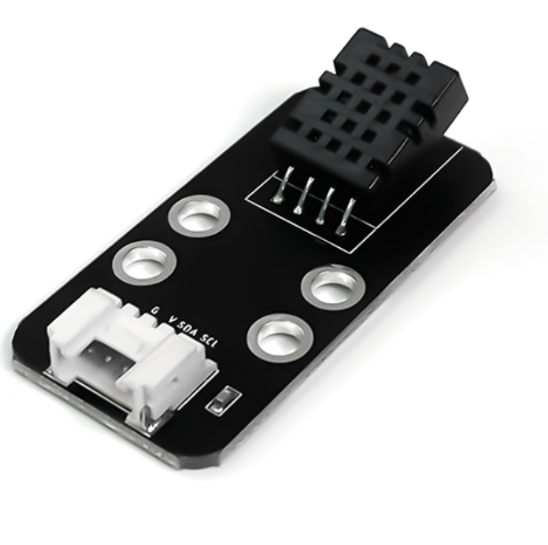
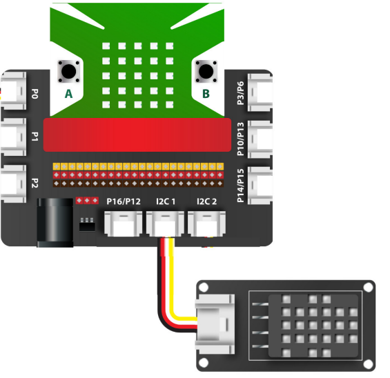
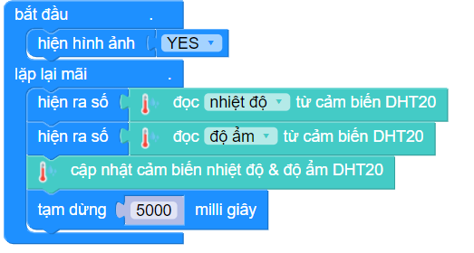

1. Cảm biến nhiệt độ độ ẩm DHT20
====================================

| 

- Cảm biến nhiệt độ và độ ẩm DHT20 sử dụng giao thức đầu ra là I2C. Cảm biến có độ chính xác cao, giá thành thấp, thích hợp với các ứng dụng cần đo nhiệt độ,độ ẩm của môi trường.

- **Ứng dụng**: Bạn có thể ứng dụng cảm biến này vào các dự án điều khiển tự động, ghi nhận dữ liệu về nhiệt độ, độ ẩm trong môi trường xung quanh, làm máy hút ẩm… và nhiều dự án khác.

**1. Mua sản phẩm**
-----------
----------

..  image:: images/gio.png
    :alt: some image
    :target: https://ohstem.vn/product/cam-bien-dht20/
    :class: with-shadow
    :scale: 100%
    :align: center
|

**2. Thông số kỹ thuật**
------------
-------------

- **Thông số kỹ thuật của cảm biến:**

    + Điện áp đầu vào: 3.3V
    + Đo phạm vi độ ẩm: 0 ~ 100% RH
    + Dải nhiệt độ đo: -40 ~ + 80 ℃
    + Độ chính xác độ ẩm: ± 3% RH (25 ℃)
    + Độ chính xác nhiệt độ: ± 0,5 ℃
    + Tín hiệu đầu ra: Tín hiệu I2C

**3. Kết nối**
------------
------------

- **Bước 1**: Chuẩn bị các thiết bị như sau: 

.. list-table:: 
   :widths: auto
   :header-rows: 1
     
   * - .. image:: images/yolo.png
          :width: 200px
          :align: center
     - .. image:: images/mmr.png
          :width: 200px
          :align: center
     - .. image:: images/1.1.png
          :width: 200px
          :align: center
   * - Máy tính lập trình Yolo:Bit
     - Mạch mở rộng cho Yolo:Bit
     - Cảm biến DHT20 (kèm dây Grove)
   * - `Mua sản phẩm <https://ohstem.vn/product/may-tinh-lap-trinh-yolobit/>`_
     - `Mua sản phẩm <https://ohstem.vn/product/grove-shield/>`_
     - `Mua sản phẩm <https://ohstem.vn/product/cam-bien-dht20/>`_

- **Bước 2**: Cắm Yolo:Bit vào mạch mở rộng
- **Bước 3**: Sử dụng dây Grove cắm vào cảm biến
- **Bước 4**: Kết nối cảm biến nhiệt độ độ ẩm DHT20 vào **chân I2C trên mạch mở rộng**

    Bạn có thể kết nối cảm biến DHT20 vào 1 trong 2 chân I2C

**4. Hướng dẫn lập trình**
--------
------------

- **Bước 1:** Tải thư viện **AIOT KIT**, xem hướng dẫn tải thư viện `tại đây <https://docs.ohstem.vn/en/latest/module/cai-dat-thu-vien.html>`_

    .. image:: images/aiot.png
        :width: 300px
        :align: center 
    |

    Sau khi tải thư viện, trong danh mục khối lệnh sẽ xuất hiện các khối lệnh tương ứng:

    .. image:: images/lenh_aiot.png
        :width: 800px
        :align: center 
    |

- **Bước 2**: Gửi chương trình sau xuống Yolo:Bit

|

.. note::

    **Giải thích chương trình:** Thông tin nhiệt độ và độ ẩm sẽ hiển thị trên màn hình LED của Yolo:Bit, và được cập nhật liên tục sau mỗi 5 giây.