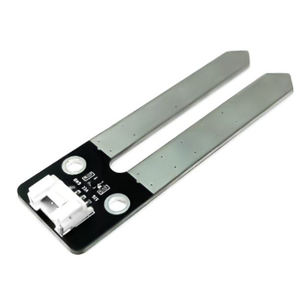

3. Cảm biến độ ẩm đất
===========

| 

- Cảm biến độ ẩm đất Soil Moisture Sensor thường được sử dụng trong các mô hình tưới nước tự động, vườn thông minh,…, Đây là cảm biến giúp xác định độ ẩm của đất và trả về giá trị Analog.

**1. Mua sản phẩm**
-----------
----------

..  image:: images/gio.png
    :alt: some image
    :target: https://ohstem.vn/product/cam-bien-do-am-dat/
    :class: with-shadow
    :scale: 100%
    :align: center
|

**2. Thông số kỹ thuật**
------------
-------------

- **Thông số kỹ thuật của cảm biến độ ẩm đất**

    + Điện áp làm việc 3.3V 
    + Sử dụng chip LM393 để so sánh, ổn định làm việc
    + Kích thước module: 48mm x 24 mm x 18mm (DxRxC)

- **Pinout của cảm biến độ ẩm đất**

Module cảm biến độ ẩm đất có 4 chân, và mỗi chân có chức năng như sau:

..  csv-table:: 
    :header: "STT", "Chân", "Chức năng"
    :widths: 10, 15, 30

    1, "GND", "Nối đất"
    2, "VCC", "Cấp nguồn (3.3V)"
    3, "NC", "Không sử dụng"
    4, "SIG", "Tín hiệu cảm biến"

**3. Kết nối**
------------
------------

- **Bước 1**: Chuẩn bị các thiết bị như sau: 

.. list-table:: 
   :widths: auto
   :header-rows: 1
     
   * - .. image:: images/yolo.png
          :width: 200px
          :align: center
     - .. image:: images/mmr.png
          :width: 200px
          :align: center
     - .. image:: images/3.1.png
          :width: 200px
          :align: center
   * - Máy tính lập trình Yolo:Bit
     - Mạch mở rộng cho Yolo:Bit
     - Cảm biến độ ẩm đất (kèm dây Grove)
   * - `Mua sản phẩm <https://ohstem.vn/product/may-tinh-lap-trinh-yolobit/>`_
     - `Mua sản phẩm <https://ohstem.vn/product/grove-shield/>`_
     - `Mua sản phẩm <https://ohstem.vn/product/cam-bien-do-am-dat/>`_

- **Bước 2**: Cắm Yolo:Bit vào mạch mở rộng
- **Bước 3**: Sử dụng dây Grove cắm vào cảm biến
- **Bước 4**: Kết nối cảm biến độ ẩm đất vào **chân P0 trên mạch mở rộng**

..  figure:: images/3.2.png
    :scale: 70%
    :align: center 

..  attention::

    Cảm biến độ độ ẩm đất có giá trị trả về là analog, trên mạch mở rộng có 3 chân có giá trị analog là P0, P1, P2. Bạn có thể kết nối vào 1 trong 3 chân này để làm việc với cảm biến. 

**4. Hướng dẫn lập trình với OhStem App**
--------
------------

- **Bước 1:** Tải thư viện **AIOT KIT**, xem hướng dẫn tải thư viện `tại đây <https://docs.ohstem.vn/en/latest/module/cai-dat-thu-vien.html>`_

    .. image:: images/aiot.png
        :width: 300px
        :align: center 
    |

    Sau khi tải thư viện, trong danh mục khối lệnh sẽ xuất hiện các khối lệnh tương ứng:

    .. image:: images/lenh_aiot.png
        :width: 800px
        :align: center 
    |

- **Bước 2**: Gửi chương trình sau xuống Yolo:Bit

..  image:: images/3.3.png
    :scale: 100%
    :align: center 
|

.. note::

    **Giải thích chương trình:** Phần trăm độ ẩm đất sẽ được hiển thị lên màn hình LED của Yolo:Bit sau mỗi giây. 

**5. Hướng dẫn lập trình Arduino**
--------
------------

- Mở phần mềm Arduino IDE. Xem hướng dẫn lập trình với Arduino `tại đây <https://docs.ohstem.vn/en/latest/module/cai-dat-arduino.html>`_. 

- Copy đoạn code sau, click vào nút ``Verify`` để kiểm tra lỗi chương trình. Sau khi biên dịch không báo lỗi, bạn có thể nạp đoạn code vào board. 

.. code-block:: guess

    #include "YoloBit.h"

    YoloBit yolobit;

    int sensorPin = P0_ADC;
    int sensorValue = 0;

    void setup() {
      Serial.begin(115200);
    }

    void loop() {
      // đọc giá trị cảm biến
      sensorValue = analogRead(sensorPin);
      Serial.println(sensorValue);
      delay(200);
    }

.. note:: 
    
    **Giải thích chương trình:** Sau khi nạp chương trình và mở cửa sổ Serial, bạn sẽ thấy giá trị đọc được từ cảm biến được in ra. Bạn hãy thử đặt cảm biến vào ly nước hay chậu đất để thấy được sự thay đổi.